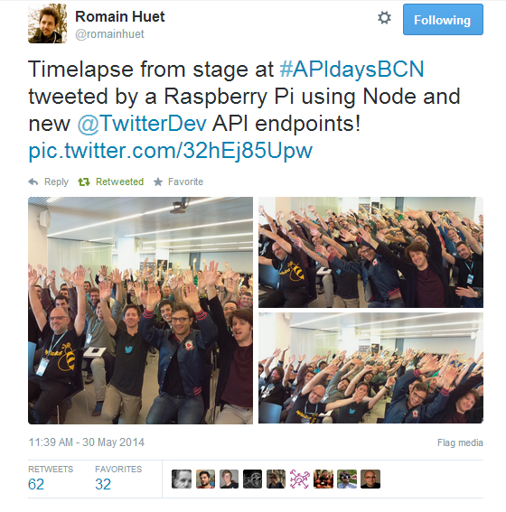
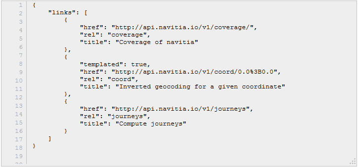
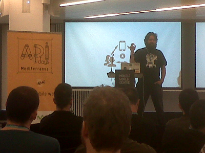

# APIDaysBCN 2014

Once again I was lucky enough to attend an API Days event. This year the  [conference was in Barcelona](http://mediterranea.apidays.io/ "API Days") . The scale of the event was noticeably increased compared to last year’s conference in Madrid. This time the venue was the  _Mobile World Centre_ in Plaza Catalunya, opposite the Bank of Spain. This in itself is perhaps an indication of the rapid evolution of the API industry.

This post is a reconstruction of my scribbles over the two days.

The API Scene
-------------

### API principles

Notes from the Kin Lane,  [The API Evangelist .](http://apievangelist.com/ "API Evangelist")

Don’t invent the wheel – use familiar patterns. For example, an API describing a profile should consider something like /me used on Facebook.

*   [https://developers.facebook.com/docs/graph-api/reference/v2.0/use](https://developers.facebook.com/docs/graph-api/reference/v2.0/use) r

Share API designs

*   [http://apicommons.org/](http://apicommons.org/ "API Commons")

Find APIs (an alternative to [Programmble Web](http://www.programmableweb.com/ "Programmable Web") )

*   [http://apis.io/](http://apis.io/ "APIs IO")

APIs and value chains from [3scale](http://3scale.net "3scale")  by  [Manfred](https://twitter.com/ManfredBo)

*   [http://www.slideshare.net/3scale/ap-idays-medapivaluenetworksweb](http://www.slideshare.net/3scale/ap-idays-medapivaluenetworksweb "3scale Value Chain")

The Power of /me from [Bruno Pedro](https://twitter.com/bpedro "Bruno Pedro on Twitter") . An overview of the battle between the online giants for ownership of user identities, with a quick dip into OAuth2

*   [http://saasinsights.getapp.com/war-over-online-identities-power-of-me/](http://saasinsights.getapp.com/war-over-online-identities-power-of-me/ "Power of /me")

APIs that offer interesting Services
------------------------------------

APIs for integrating online payments

*   [https://www.paymill.com/en-gb/](https://www.paymill.com/en-gb/ "paymill")
*   [https://stripe.com/gb](https://stripe.com/gb "stripe")

APIs for sending emails

*   [http://context.io/](http://context.io/ "context io")
*   [http://sendgrid.com/](http://sendgrid.com/ "sendgrid")

Examples of real-time APIs and webhooks

*   [http://instagram.com/developer/realtime](http://instagram.com/developer/realtime/ "instagram") /
*   [https://dev.twitter.com/docs/api/streaming](https://dev.twitter.com/docs/api/streaming "Twitter Streaming")
*   [https://github.com/dazhbog/AGL-Jarvis/tree/master/node\_modules/socket.io](https://github.com/dazhbog/AGL-Jarvis/tree/master/node_modules/socket.io "AGL Jarivis")

Twitter APIs from [Romain Huet](https://twitter.com/romainhuet "romain huet") . The Twitter demo covered three topics

1.  Monitoring and filtering Tweets in real time from the Streaming APIs
2.  Tweeting pictures from a Raspberry Pi and its Camera Module
3.  Controlling a Parrot AR.Drone from Tweets and acknowledging commands

Source code from the demos is available here

*   [https://github.com/romainhuet/twitter-platform-demos](https://github.com/romainhuet/twitter-platform-demos "Romain Huet on Github")

Each topic is covered in more detail

*   [https://dev.twitter.com/docs/streaming-apis/streams/public](https://dev.twitter.com/docs/streaming-apis/streams/public)
*   [https://dev.twitter.com/docs/api/1.1](https://dev.twitter.com/docs/api/1.1)
*   [https://apps.twitter.com/](https://apps.twitter.com/)
*   [https://engineering.twitter.com/opensource](https://engineering.twitter.com/opensource)

Streaming is based on all the tweets, an average of ~500 million tweets per day exposed through _Firehose_ .

[Vigiglobe](http://vigiglobe.com/v2/ "Vigiglobe")  are using Twitter streams to analyse public opinion

*   [http://www.thedrum.com/news/2012/07/30/kantar-and-vigiglobe-analytics-shows-over-80-twitter-users-reacted-positively](http://www.thedrum.com/news/2012/07/30/kantar-and-vigiglobe-analytics-shows-over-80-twitter-users-reacted-positively)

Another example, the Brit Awards peaked at 78k tweets per minute. The endpoints are simple.

POST https://stream.twitter.com/1.1/statuses/filter.json
                            POST https://stream.twitter.com/1.1/statuses/sample.json
                            (links needs to be within an Authenticaton context)

The sample endpoint streams one percent of the entire Firehose. You need some serious infrastructure and commercials to consume the whole thing. The Twitter Streaming API uses long polling to hold a connection open. The Twitter recommendation is that stream consumers use a single client running on their network (something like Node.js) to harvest and filter tweets. The client would then use web sockets to push notifications out to website visitors.

Another cool thing is the Amazon integration with Twitter allows users to add items to their shopping cart through #AmazonBasket.

*   [http://techcrunch.com/2014/05/05/amazon-extends-its-shopping-cart-to-twitter/](http://techcrunch.com/2014/05/05/amazon-extends-its-shopping-cart-to-twitter/ "Amazon Twitter")

More information about become a certified Twitter partner

*   [https://business.twitter.com/partners/list/certified-products](https://business.twitter.com/partners/list/certified-products "Twitter Business")

Here’s that photo taken by a tweeting Raspberry PI (I’m in there somewhere).

Dropbox updates from [Leah Culver](https://twitter.com/leahculver "Leah Culver")

Dropbox have recently added support for datastores to their APIs. This turns a dropbox folder into a NoSQL database, located in the cloud.

*   [https://www.dropbox.com/developers/datastore/tutorial/js](https://www.dropbox.com/developers/datastore/tutorial/js)

The user account defines the quota. And here’s an example that uses datastore to hold game state and high scores

*   [https://github.com/leah/2048](https://github.com/leah/2048 "2048")

(2048 is a game that everyone is going crazy about .. apparently).

Other Stuff
-----------

Big data for free (as in beer)

*   [https://teowaki.com/teams/javier-community/link-categories/bigquery-talk](https://teowaki.com/teams/javier-community/link-categories/bigquery-talk "Javier from Teowaki")

Using _Dremel_ an open source java implementation of Google Big Query and Redis is in there too.

Tools and Tips for API Designers
--------------------------------

The wireshark of API sniffing (from 3scale who were conference sponsors by the way)

*   [https://www.apitools.com/](https://www.apitools.com/)

Slides from the conference

*   [https://speakerdeck.com/mikz/reverse-engineering-apis](https://speakerdeck.com/mikz/reverse-engineering-apis)

API design at Heroku from  [@brandur](https://twitter.com/brandur)

Insightful review of the API design process undergone by Heroku. The APIs control access to the Heroku platform and prior to the release of v3 was extensively re-designed. The API is innovative through it’s use of [JSON Schemas](http://json-schema.org/ "json schemas") . Heroku have generously published the API guidelines that were developed as a result of the process.

*   [https://github.com/interagent/http-api-design](https://github.com/interagent/http-api-design)
*   [https://github.com/interagent/prmd](https://github.com/interagent/prmd)

Conference slides

*   [http://thousand-services.herokuapp.com/](http://thousand-services.herokuapp.com/ "thousand services")

Example of API that uses Hypermedia well (from [Ori Pekelman)](https://twitter.com/OriPekelman "Ori Pekelman")

In true Hypermedia style, this is the only published endpoint – everything else is through discovery

GET http://api.navitia.io/v1/

How to do Hypermedia well

Example from Salesforce of a Mobile API using Angular

*   [https://developer.salesforce.com/docs/atlas.en-us.salesforce\_platform\_mobile\_services.meta/salesforce\_platform\_mobile\_services/mobile\_packs\_angular.htm](https://developer.salesforce.com/docs/atlas.en-us.salesforce_platform_mobile_services.meta/salesforce_platform_mobile_services/mobile_packs_angular.htm)

Optimistic API Design from [Pau Ramon Revilla](https://twitter.com/masylum "Pau") / Api designer @ redbooth.com

Use PATCH for partial updates

problem: two PUTs in a race condition but only one can win

PUT { "name":"Robert", "hiScore":"25", "id":"123" }
                            PUT { "name":"Bob", "hiScore":"35", "id":"123" }

because PUT requires the entire payload. PATCH allows a partial update.

PATCH { "hiScore":"25", "id":"123" }
                            PATCH { "hiScore":"35", "id":"123" }

More on [PATCH](http://restcookbook.com/HTTP%20Methods/patch/) . Use a 202 response for non-deterministic operations.

DELETE /things/1

202 # accepted for further process
                             { "rel":"/things/1/AD234" }

… some time passes

GET /things/1/AD234

200 # deletion request processed

[Ronnie Mitra](https://twitter.com/mitraman "Ronnie Mitra")  from Layer 7 presented a tool for prototyping API designs. Using a drag-n-drop interface the tool allows an API designer to create API endpoints as “cells”. There is some automation for the process of creating dummy request / responses and also support for Hypermedia-style linking. Ronnie promised me that it will export to WADLs and other API specification formats.

Finally here’s a picture of the main man, KinLane.

:calendar: May 31, 2014
