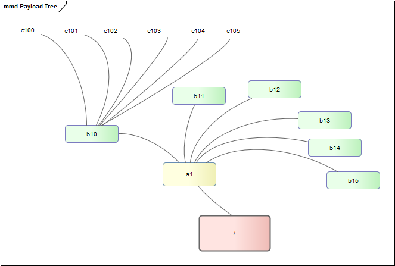

# API Design for large hierarchies

## Introduction to the Problem

Some things that you may, or may not know about a Wolverine.

    
    
    {
        "aliases": [
            "glutton",
            "skunk bear"
        ],
        "range": "620 km",
        "weight": "9-25 kg",
        "topSpeed": "48km/h",
        "lifestyle": "Solitary",
        "lifeSpan": "10-15 years",
        "conservationStatus": "Threatened",
        "habitat": "Mountainous regions and dense forest",
        "culture": "Michigan is known as the Wolverine state",
        "claimToFame": "In order to steal a kill a wolverine attacked a polar bear and clung to its throat until the bear suffocated."
    }

Given that the the taxonomy of the living world contains around 8.7 million
species. The challenges presented by this wolverine snippet are all about
catalog and index management. The navigation of a large hierarchy is therefore
something that API designers need to address when designing their interfaces.
REST defines constraints that help us organise resources, but REST isn't
aligned to any particular data model. We therefore need to work out how best
to manage hierarchical data ourselves. This post is based on experience from
the design of a working system.

### Limitations of the client

Rather than tackle the tree of life, I will use a tree of "things" to help
model the API design. But firstly we need to understand two important
limitations of our imaginary clients.

  1. The maximum payload our client can manage is 512 kilobytes, i.e. half-a-meg.
  2. The client is pretty dumb and will not be able to traverse the hierarchy without assistance.

### Introducing a tree of things

The total number of things in our fictitious tree is 258. Things are nested
down to a depth of three. Each thing contains exactly six other things. The
following diagram shows a slice of the tree.

The things are named using the following convention.

    
    
    A1		B10 .. B16		C100 .. C106
    A2		B20 .. B26		C201 .. C206
    ... 
    A6 		B60 .. B61 		C600 .. C601

In the tree of things the smallest payload that a node can return is 96
kilobytes. Doing the maths and the total size of the model works out at 4.03
megabytes (4,128 kb).

level | kilobytes | numOfItems  
---|---|---  
|  
A | 96 | 6  
B | 576 | 36  
C | 3,456 | 216  
|  |   
| 4,128 | 258  
  
In the common scenario the client would access the API with the following
request.

    
    
    GET /things/A/B/C/204

And the server would respond as follows:

    
    
    {
        "id": "C204",
        "items": [ 1, 2, 3, 4, 5, 6 ]
    }

We are pretending that each item is 16 kilobytes and so we're happy that the
total 96 kilobytes is well within the required payload limit. This okay for
the _happy path_ but as-it-stands the design exposes a lot of loose endpoints.
For example, what should the server do with the following request?

    
    
    GET /things/

The server cannot respond with everything in A, plus all the B things together
with their C descendants because the payload would be 4.03 mb, i.e. the full
hierarchy. Perhaps a more reasonable response would be to remove the B and C
descendants leaving just those in the range A1 to A6. Hmm, but now we're
starting to make assumptions about the request .. let's play safe for now and
just tell the client they asked for too much.

    
    
    GET /things/ 				# 416 Requested Range Not Satisfiable

Using this approach I can complete my API design.

    
    
    GET /things/A/B/C/204 		        # 200 Success 
    GET /things/A 				# 416 Requested Range Not Satisfiable
    GET /things/ 				# 416 Requested Range Not Satisfiable
    GET /things/A/1/B/10		        # 200 Success
    GET /things/A/3 			# 200 Success

At this stage the design is functional as it satisfies our minimum payload
criteria. But it isn't that easy to navigate. The top-level responses are
blocked, and those responses that are returned are simply a flat list. It's
hard for my dumb client to know what to do with these. A response like this
would be an improvement.

    
    
    {
        "id": "A3",
        "items": [
            {
                "id": "B30",
                "items": [
                    {
                        "id": "C300",
                        "items": [
    
    	                    /* more items here */
                        ]
                    },
    
                    /* and more here too */
                ]
            }
        ]
    }

Although this creates a payload problem (it weighs in at 688 kb) it shows
promise because I can start to educate my client about the nature of the
hierarchy.

### Using depth to control the payload

To help the client get to know the tree of things without breaking the
payload, I add the following parameters to my design.

    
    
    GET /things/A/3/A/B

This meaning of the additional A/B parameter is to instruct the server to give
me the descendants of B, as well as the list of A items that were discussed
previously. Here's the response.

    
    
    {
        "id": "A3",
        "items": [
            {
                "id": ["B31", "B32", "B33", "B34", "B35", "B36"]
            }
        ]
    }

Effectively I've filtered out C and thus got my payload down to 112 kilobytes.
The client has a response that matched the request and thus enough information
to start the descent into the hierarchy.

### Using hypermedia to improve on the 416 method and help discovery

The new controls allow the client to control the depth of the nested response
but there is still room for improvement. If the client initially goes for data
that is out of the bounds of my payload limit, then the server must still
return an error.

    
    
    GET /things/A/3/A/B/C 				# 416 Requested Range Not Satisfiable

After receiving the 416 response they have to try again by trimming the depth
back to A/B. But how can my dumb client figure this out from a 416 status
code? This is where [HATEOS](http://en.wikipedia.org/wiki/HATEOAS "Hypermedia
as the engine of application state") can help! As the server knows the payload
limits it can construct compliant URLs and pass those onto the client. For
example.

    
    
    {
        "id": "A3",
        "links": {
            "next": "/things/A/3/A/B",
            "prev": null
        }
    }

Using the links part of the response we can now return a 200 whenever the
request has gone out-of-bounds. The links redirect the client towards the part
of the hierarchy that can be reached from the current location. To achieve
this the client has some simple logic to perform.

    
    
    if (res.links) {
    	callService(res.links);
    } else if (res.items) {
    	renderItems(res.items);
    } else {
    	// panic!
    }

In summary, the features of the API design.

  * Allow the depth of the response to be specified in the request.
  * Return links rather than errors when the requested payload size is excessive.
  * The navigational links should be sensitive to the current location in the hierarchy.
  * The links communicate to the client the maximum depth that a resource can support when providing a response.

To finish off let's briefly return to our wolverine. Assuming that we are able
to discover the wolverine endpoint through navigation, we would end up with
something like the following.

    
    
    GET /species/vertebrates/carnivores/weasels/wolverine
    
    {
        "id": "wolverine",
        "items": { /* snipped wolverine facts */ },
        "links": {
            "next": [
                "/species/vertebrates/carnivores/weasels/wolverine/luscos",
                "/species/vertebrates/carnivores/weasels/wolverine/gulo"
            ],
            "prev": "/species/vertebrates/carnivores/weasels"
        }
    }

The wolverine item fits ours size requirement and so we get the payload. As it
turns out there are two sub-species (American and European) we get some
further navigation too. It would be fun to prove this out with a really big
data set and see how well the model holds up. I hope this walk-through has
illustrated some of the problems and solutions surrounding API design and
large hierarchies.

:calendar: July 16, 2013
