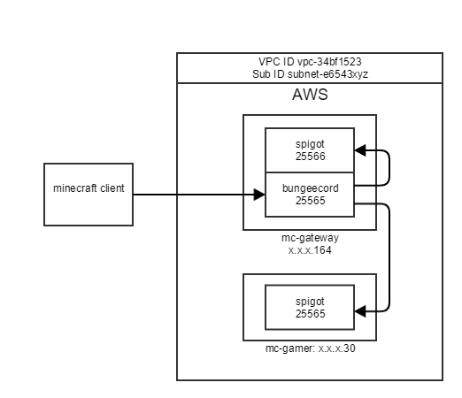
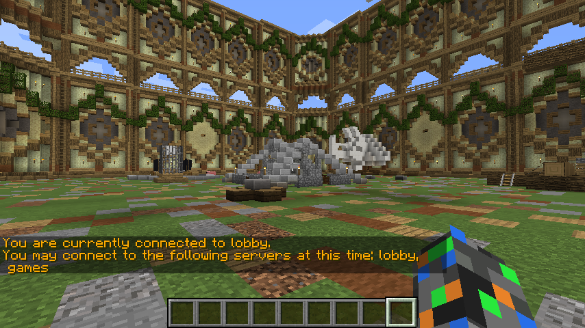

# AWS, Minecraft and Bungeecord

This is an account of how mc.fnarg.net was setup on Amazon as a distributed cluster of Minecraft nodes.

#### CREATING THE INSTANCES ON AMAZON
We logged into the AWS console and went to the EC2 console. Try https://console.aws.amazon.com/ec2/ and you should be redirected to a region.
Then we created two t2.micro instances. Each instance was created with an image size of 8GB. The linux distro was Ubuntu 16.04 LTS.

Both instances are in the same security group. Check that the VPC ID and Sub ID are the same for both instances. It should be similar to:
```
VPC ID Sub ID
vpc-34bf1523 subnet-e6543xyz
```
To help follow the story, the instance names and private IP adresses are shown below:
```
mc-gateway: x.x.x.164
mc-gamer: x.x.x.30
```


To complete the setup we connect to each instance as follows.

```
ssh -i ~/.ssh/aws.pem ubuntu@mc.fnarg.net
```

In this case we are using a Mac, you can use Putty on Windows.

#### INITIAL SERVER SETUP AS UBUNTU USER

Once we are logged on then we prepared each instances by installing some prerequisites.
```
sudo apt-get update
sudo apt-get install git
sudo apt-get install openjdk-8-jre-headless
```
Then we checked the java install using
```
ubuntu@ip-x-x-x-30:~$ java -version
openjdk version "1.8.0_131"
```
Next we added a minecraft group and user. This just adds a bit more security by separating process from the ubuntu user.
```
sudo addgroup --system minecraft
sudo useradd -g minecraft -m minecraft
sudo su - minecraft
```
And finally we started our favorite window manager to allows us to keep things running once we logout.
```
script /dev/null
screen
```
Screen needs the script command because we have done su.

#### SETUP A NODE AS MINECRAFT USER

We just follow the instructions on the Spigo site
https://www.spigotmc.org/wiki/buildtools/
```
mkdir /home/minecraft/build
cd /home/minecraft/build/
curl -o BuildTools.jar https://hub.spigotmc.org/jenkins/job/BuildTools/lastSuccessfulBuild/artifact/target/BuildTools.jar
git config --global --unset core.autocrlf
java -jar BuildTools.jar
```
After a while the build process completed, so we had a look at what it did.
```
minecraft@ip-x.x.x-30:~/build$ ls -1F
apache-maven-3.5.0/
BuildData/
BuildTools.jar
BuildTools.log.txt
Bukkit/
CraftBukkit/
craftbukkit-1.12.1.jar
Spigot/
spigot-1.12.1.jar
work/
```
When Spigot upgrades we will do this again, so to keep things neat we run the minecraft server somewhere else.
```
mkdir /home/minecraft/server
mv spigot-1.12.1.jar ../server/spigot.jar
cd ../server/
```
Next we copy a start.sh from Spigo and fix the permissions. We have to edit server.properties too.
```
online-mode=false
```
This is because our clients will connect via the gateway. And on the mc-gateway node only, we change the port so we don’t clash with the gateway.
```
server-port=25566
```
Run `./start.sh` once, update the eula.txt and we’re done.

#### SETUP A GATEWAY AS MINECRAFT USER

The last chapter is about setting up the gateway. This is a summary of instructions at
https://www.spigotmc.org/wiki/bungeecord-installation/

First make sure we are connected to the mc-gateway instance.
```
mkdir /home/minecraft/gateway
cd /home/minecraft/gateway
curl -o BungeeCord.jar https://ci.md-5.net/job/BungeeCord/BungeeCord.jar
```
As with Spigot we need a start script to run it.
```
#!/bin/sh
# https://www.spigotmc.org/wiki/bungeecord-installation/
java -Xms512M -Xmx512M -jar BungeeCord.jar
```
In the config.yml we update the servers section to reflect our architecture.
```
servers:
lobby:
motd: '&1Fnarg Lobby'
address: localhost:25566
restricted: false
timeout: 30000
games:
motd: '&1Fnarg Games'
address: x.x.x.30:25565
restricted: false
timeout: 30000
```
And lastly we run the gateway and connect from our Minecraft client. Our lobby and game nodes are shown as options when we hit /server.



There was some additional work to add plugins on the nodes, but that’s enough for now. Thanks for reading

:calendar: Posted on September 17, 2017
