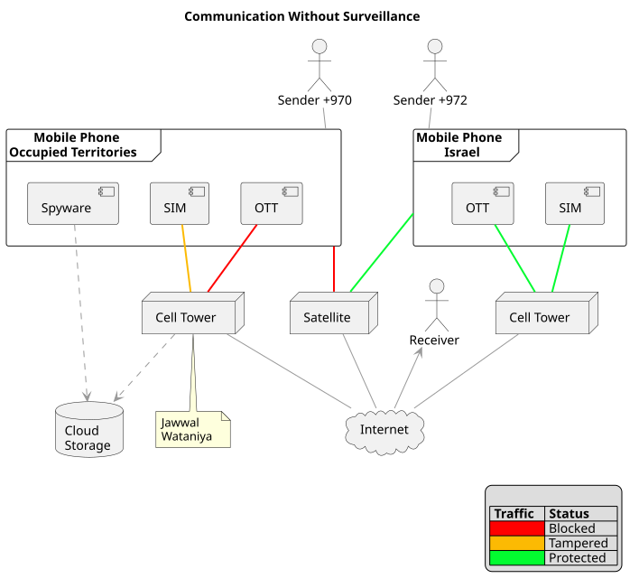
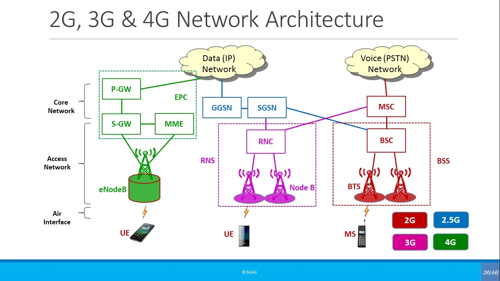
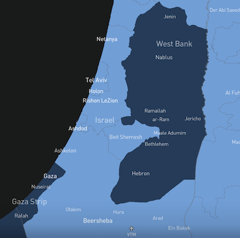

# Communication Without Surveillance
_On the privacy rights of Palestinians in Israeli controlled territories._

## Human Rights and Privacy Law
The Office of the High Commission on Human Rights have defined [standards for privacy in the digital age](https://www.ohchr.org/sites/default/files/HRBodies/HRC/RegularSessions/Session27/Documents/A.HRC.27.37_en.pdf). The standards provide a framework for governments to develop their own operational policy. Essentially it boils down to:

> no one shall be subjected to arbitrary or unlawful interference with his or her privacy, family, home or correspondence

In practise however, this is largely an aspirational standard. Government implementations are not aligned due to the delicate balance between national security and civil liberties. Most goverments do however agree on the principle that security forces should show:

> Legitimate Aim: Surveillance must be strictly necessary to achieve a recognized, lawful objective, such as protecting national security or preventing crime

Terrorism is a legitmate aim.

In the case of Israel and Palestine inequality exists as the Palestinians are not entitled to use the same infrastructure as Israeli citizens. This affects the privacy rights of the Palestinians. For example, this report by the Boycott, Disinvest, Sanction (BDS) movment [Israeli Spyware Facilitates Human Rights Violations](https://bdsmovement.net/israeli-spyware-facilitates-human-rights-violations) describes how Spyware targetted 50,000 people. Aside from privacy concerns, the networks serving the occupied territories are unreliable due to outdated protocols (2G) and may be not be available due to bombing and power blackouts.

## Israeli regulation and digital communication
To make the case for _Communication Without Surveillance_ we must first outline  the regulatory framework and operational context in which communications are taking place.

[Shin Bet](https://en.wikipedia.org/wiki/Shin_Bet) is Israel's internal security and counterintelligence service. 

[Unit 8200](https://www.reuters.com/world/middle-east/what-is-israels-secretive-cyber-warfare-unit-8200-2024-09-18/) is the equivalent of the U.S. National Security Agency or Britain's GCHQ, and is the largest single military unit in the Israel Defence Force (IDF).

Israel Security Forces are bound by WireTapping and SpyWare laws. The Wiretap Act (1979) demands that interception is approved. In 2021 the courts approved (white-washed) more than 99 percent of cases. 

_source_: [Israel’s Spyware Law: A Step Towards Authoritarianism?](https://www.giga-hamburg.de/en/publications/giga-focus/israel-s-spyware-law-a-step-towards-authoritarianism)

The SpyWare Law is an extension to the WireTapping law. The amendment would permit the installation of spyware on a mobile device to become legally equivalent to setting-up a microphone in a person's home. The amendment has received conditional approval from the Government of Israel.

This move by the Israeli Government comes at a time 
[when the use of Spyware by the United States Government](https://bidenwhitehouse.archives.gov/briefing-room/statements-releases/2023/03/27/fact-sheet-president-biden-signs-executive-order-to-prohibit-u-s-government-use-of-commercial-spyware-that-poses-risks-to-national-security/) has been prohibited. The US have taken these steps to protect civil rights, given new threats arising from the use of Spyware by US agencies.

These policy changes revolve around information that has emerged about Pegasus. Pegasus is Spyware owned by the Israeli NSO group, more on that later ...
## Technology landscape and security operations
The Israeli authorities are exercising three types of control.

1. Interception on mobile devices
1. Interception on mobile networks
1. Blocking of satellite networks

__Diagram notes__
1. The `SIM` component represents Voice and SMS traffic
1. `OTT` means Over-The-Top application. For example WhatsApp is an OTT app with End-to-End Encryption (E2EE)

The characterisation of `Jawwal` and `Wataniya` as hostile networks is only partially true. Spyware targets any blacklisted individual, irrespective of the network. The blacklist is most likely to include:
journalists, human rights activists, political dissidents, opposition politicians, lawyers, and government officials.

### Mobile devices
The threat to a mobile device stems from Spyware that runs natively on a mobile phone. 
Pegasus spyware is linked to Israel as it is owned by the NSO group and Unit 8200 were involved in development. 
Security experts Group-B describe what Pegasus does
> Pegasus infects mobile devices through zero-click exploits and silently harvests messages, calls, location, and microphone access. 

_source_: [Pegasus spyware and how to detect it on your mobile devices](https://www.group-ib.com/blog/pegasus-spyware/)

Mobiles imported into the occupied terrirtories are believed to have the Pegasus spyware installed.

>  Every mobile or phone imported into Gaza through the Kerem Shalom crossing – in Gaza's south – is implanted with an Israeli bug, and anyone using the only two mobile networks serving the occupied territories – Jawwal and Wataniya – is monitored as well.

_source_: [Surveillance In Palestine: The Implications of Israeli Online Surveillance on the MENA Region and the World](https://arabifactshub.com/en/researches/details/43843).

Once a mobile device is running Pegasus, data is exposed as follows:

- Complete Surveillance of Communications
- Unauthorized Camera and Microphone Access
- GPS Tracking and Location Monitoring
- Data Theft (Files, Photos, and Passwords) 

An investigation reported by Amnesty International describes how six human rights defenders were found to have Pegasus installed.

_source_: [Devices of Palestinian Human Rights Defenders Hacked with NSO Group’s Pegasus Spyware](https://www.amnesty.org/en/latest/research/2021/11/devices-of-palestinian-human-rights-defenders-hacked-with-nso-groups-pegasus-spyware-2/)

The NSO Group are under-pressure from civil rights activitsts and humanitarian groups. Furthermore, legal action by WhatsApp resulted in the
[Maker of Pegasus spyware told to pay $167m for WhatsApp hack](https://www.bbc.co.uk/news/articles/c77n76kzmz4o). The final settlement was around $4.5m.

### Mobile networks
The international calling code for Israel is +972 with +970 being used for the Occupied Territories (see [Telephone numbers in Palestine](https://en.wikipedia.org/wiki/Telephone_numbers_in_Palestine)). Numbers with the +970 prefix are served by the Jawwal and Wataniya networks. Voice and SMS data sent over the Jawwal and Wataniya networks can be easily monitored by the IDF.
> Radio signals from your phone terminate at the operator’s tower, where air-interface encryption is decrypted before being routed into the wired core network.  

This is because the _operator_ in this case is Unit 8200 of the IDF.

These networks were deliberately not upgraded from 2G, a protocol that offers least resistance to interception by the network operator.

_source_: [Introduction to mobile network intrusions from a mobile phone](https://medium.com/mobile-stacks-and-networks-security/introduction-to-mobile-network-intrusions-from-a-mobile-phone-9a8e909cc276)

As shown in the above diagram, the architecture changed from 2G onwards. The introduction of Data Networks to the 3G architecture would support E2EE. This would seem to explain the following justification from the security forces.

> “Israel” claims that granting advanced communication technologies to Gaza could enhance the ability of armed factions to coordinate, plan, and carry out attacks

_source_: [Controlling the Narrative: Why ‘Israel’ Keeps Gaza Confined to 2G Telecommunications](https://alestiklal.net/en/article/controlling-the-narrative-why-israel-keeps-gaza-confined-to-2g-telecommunications)

### Satellite networks
Starlink is the world's leading provider of network services by satellite. 
The following map shows that Gaza and the West Bank are unavailable, presumably because a license to operate does not exist between Starlink and the authorities in Israel.

_source_: https://starlink.com/il/map

There is however, an exception. Elon Musk [posted that](https://x.com/elonmusk/status/1815861901395382520?s=20)
> Starlink is now active in a Gaza hospital with the support of @UAEmediaoffice and @Israel  

This post (from 2024) shows that Starlink is technically capable of working in Gaza and perhaps more importantly it shows that safeguards such as geofencing and terminal unit verification can win approval from Israel's Ministry of Communications.

In the event that an agreement with Starlink cannot be reached, there are alternatives. For example Spanish provider [hisdeSAT](https://www.hisdesat.es/en/seccion/satellites/) has coverage.

## References
Use-cases and stories on how Israel uses technology for surveillance.
#### Pegasus
Fatma Hassouna was a photo-journalist documenting Palenstinian life. Her appearance at the Cannes Film Festival was announced the day before she and her family were killed.
They were killed in their home in Gaza by two missiles. 

_source_: [kill The Press](https://staging.forensic-architecture.org/wp-content/uploads/2025/05/2025.05.14-Kill-The-Press-1-Fatima-Hassouna.pdf)

Assuming that the missiles were guided by GPS data from Fatima's mobile phone, the GPS co-ordinates would almost certainly have been sourced using Pegasus. 
Although the report does not explicitly state that GPS was used to guide the missiles. What other method exists?  Given the context of Pegasus it is the most likely explanation.
Also, Amnesty International have documented similar cases, see
[Forensic Methodology Report: How to catch NSO Group’s Pegasus](https://www.amnesty.org/en/latest/research/2021/07/forensic-methodology-report-how-to-catch-nso-groups-pegasus/).
#### Cloud
In August of 2025, the Guardian reported that
Azure was being used by Unit 8200 to store mass surveillance data. 

_source_: [Israel relying on Microsoft cloud for expansive surveillance of Palestinians](https://www.theguardian.com/world/2025/aug/06/microsoft-israeli-military-palestinian-phone-calls-cloud). 

According to [this post on x.com](https://x.com/ajplus/status/2082179285708874042?s=20)
Microsoft were unaware how Azure was being used. 
Within a month Microsoft responded by placing restrictions on the Unit as covered in the report by Amnesty International
[Microsoft’s move to block Israeli military unit’s access to its mass surveillance technology is a moment for corporate reckoning](https://www.amnesty.org/en/latest/news/2025/09/microsoft-block-israel-military-unit-from-using-its-technology/). Other tech giants, e.g. AWS and Google are also alleged to be involved,

#### Palantir
Data by itself does not pose a threat. It is the analysis through Machine Learning (AI) that reveals interesting patterns. Palantir are world leaders in security and data mining. This report on Yahoo News confirms their partnership with Israel.
[Israel agreed to harness Palantir's advanced technology in support of war-related missions](https://www.yahoo.com/news/peter-thiel-trapped-inside-student-120749948.html).

#### WhatsApp
WhatsApp is an Over The Top (OTT) application, so called because it rides over the mobile network using HTTP protocols for transport. OTT applications offer End-to-End encryption which is a challenge for government organisations interested in surveillance. Although the following article is focussed on EU law, it explains how governments can maintain the "delicate balance" in the case of OTT. 

_source_: [OTT Lawful Interception: Why WhatsApp, Teams and Telegram Must Enable Legal Access Under EU Law](https://ic-services.io/resources/blog/ott-lawful-interception-whatsapp-teams-telegram/).

The way to hack on OTT application is to compromise __endpoint security__. This means directly accessing keystrokes and microphone on the device, BEFORE the OTT endpoint can begin encryption. This is precisely what Pegasus does.

The following article is interesting because it reveals how Hamas understands security controls.

_source_: [How did Israel intercept WhatsApp calls during Oct 7 2023?](https://security.stackexchange.com/questions/280886/how-did-israel-intercept-whatsapp-calls-during-oct-7-2023)

The scenario involves two phones, with two simultaneous calls taking place.

1. A SIM call from the mobile of the Jewish woman who has just been killed
1. An OTT call from the mobile of the attacker who wants to switch to video

Assuming that the victim had a +972 number, then as a Jewish person with 
a clean profile (not a terrorist) their number should not be blacklisted.
Given the candid nature of the conversation on the first call
we should assume that Hamas believed they were talking in secret. Here is an extract from the transcript.

> “Hi dad — Open my WhatsApp now, and you’ll see all those killed. Look how many I killed with my own hands! Your son killed Jews!”

_source_: [The Bright Line Between Good and Evil](https://www.samharris.org/blog/the-bright-line-between-good-and-evil)

However the call *was* intercepted. This is hard to explain, unless calls from both +970 and +972 numbers are being routinely monitored.

As the caller is from Gaza, the second call can be assumed to be made on the +970 network, despite the low quality of WhatsApp video over 2G.

## Possible solutions
The 50,000 persons that are currently surveyed can be seen as a __blacklist__ managed by the security forces.
No changes are proposed to the blacklist, except that any individual on the whitelist is automatically removed. That is the lists MUST be mutually exclusive. No-one can be on both lists simultaneously.

The main idea here is to create a __whitelist__. Persons that are approved MUST be given the following benefits.

1. Access to a reliable network that supports 4G protocol or higher.
1. A process to identify and remove the spyware used to survey those on the blacklist.

These approval and verification procedures SHOULD be devolved, that is managed by an authority that is close to the effected communities.

## Governance and implementation
### Governance
Without effective governance any chosen solution will fall short of meeting the objectives of this proposal. Three types of governance are required:

1. Israeli organisations that manage the communication infrastructure
1. Organisations responsible for managing whitelists and spyware removal  
1. Whitelisted individuals who are responsible for terminal compliance

The first level of governance should be external to Israel, e.g. a UN delegation.
The second level should be defined by an Israeli organisation, e.g. Ministry of Communications.
At the third level, terminal compliance is to ensure that network access is controlled. Mobile phones MUST NOT be used to forward requests from unregulated downstream devices.

### Implementation
A satellite network will be easier to implement than a mobile network, offer greater resiliance to on-the-ground threats and provide effective secrecy through OTT applications. To provide a satellite service to Palestinians would require:
* An operational license between the satellite provider (e.g. Starlink) and Israel authorities
* Palestinians that are whitelisted to be supplied a router and access to control software

A regional version of the router control software MAY be required. For example, to enforce access from a known network (+970) and identify phone numbers against the whitelist.

Non-technical users MUST be able to verify that their devices are free from Spyware (Pegasus). To assist, a detect and removal service SHOULD be provided. The [Mobile Verification Toolkit](https://docs.mvt.re/en/latest/) has been developed by the Amnesty International Security Lab to combat Pegasus. The toolkit requires expertise, so end-user spport will be essential.

## Summary
Resolving the Middle-East conflict often feels hopeless. 
If implemented, how would this proposal to _Communicate Without Surveillance_ actually help?
Communication and Privacy are at the heart of all human relations.
Furthermore, digital communication has evolved rapidly and become an essential part of modern life.
Privacy is not however, a component of the latest peace plan, although
[Trump's 20-point Gaza peace plan](https://www.bbc.com/news/articles/c70155nked7o) provides some opportunities (point 10).
The scope of this proposal is limited, but it does offer some hope for the future; privacy and a degree of dignity to Palestinians and an
an opportunity for Israel to show compliance with international standards. Please support the proposal.

### Document control

| Version | Change description |
| --- | --- |
| 1.1 | Shared with israelpalestine@amnesty.org |
| 1.0 | Initial release to https://github.com/snow6oy/blog/CWS.md |

#### About the author

* [Gavin Johnson](https://www.linkedin.com/in/gavinjohnson/) is an experienced Software Engineer and a beginner 
in Human Rights activism.

