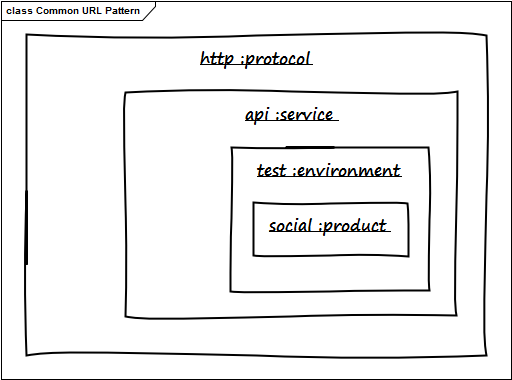

# Common URL Pattern

When architecting with domains, services and URLs this pattern seems to come
round a lot, but I've never heard of it being given a formal name or
description:

> **protocol. service. env. example. com / product**

I will call it the _Common URL Pattern._ In a real-world scenario it would
resolve to something like:
`http://www.test.example.com/support`

Here is the same pattern again but this time
expressed by throwing some UML around.

content/uploads/2013/07/commonurlpattern.png)Common Url Pattern

And finally by way of explanation, some comments on the parts.

protocol | Underlying transport layer such as https, smtp  
---|---  
service | Shared across a technology stack: www, mail, api, db  
environment | Instances of the stack with functional variation, e.g. test, dev  
domain | Identifier in the Internet namespace: a.b.c  
product | A website or application that handles end-user interaction, e.g. /blah  
  
It seems like a fairly adaptable model that can be applied to a large number
of websites and web-based applications.

:calendar: July 2, 2013

