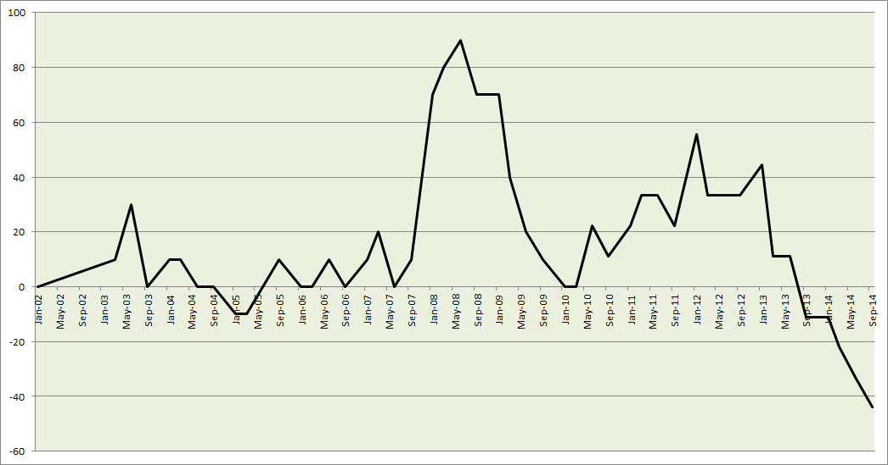
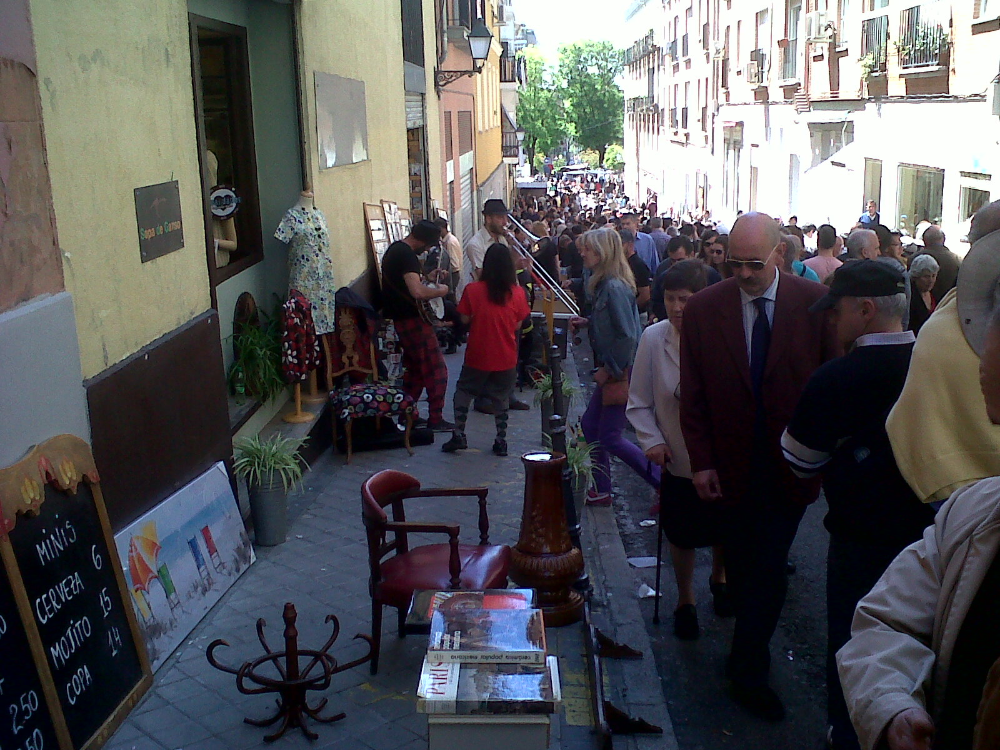
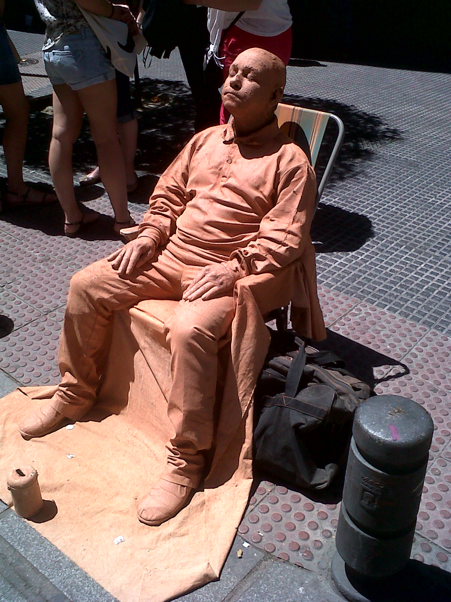
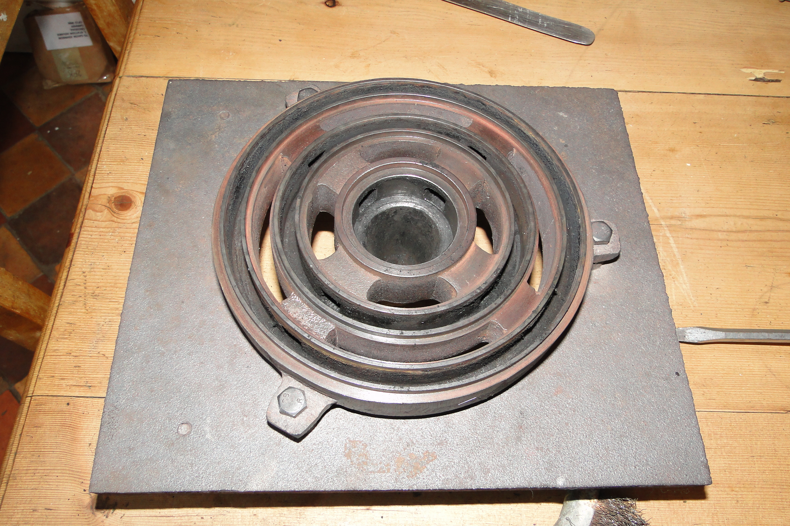
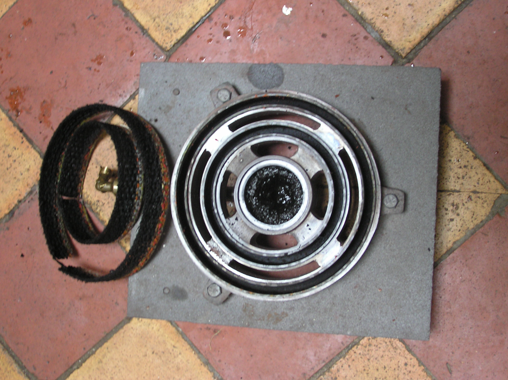
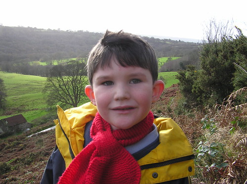
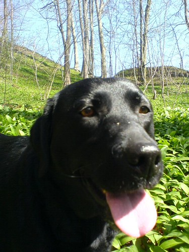
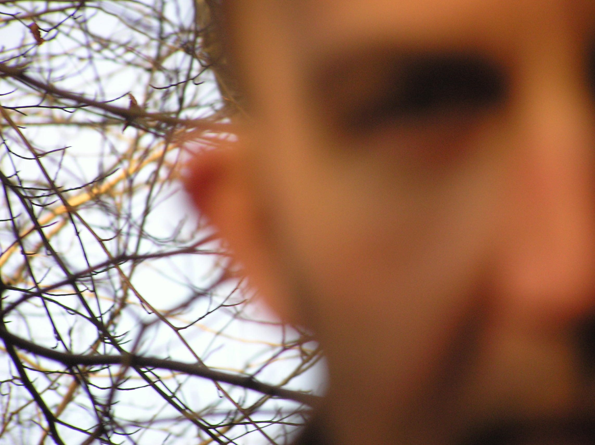

# Dad

Parenthood and general rants at society

## Manchester Attack

The extermination of a single mosquito does not eradicate malaria  
Another approach is to target the breeding grounds, rivers, swamps etcetera.

At the heart of the Manchester tragedy is a young man who decided to end his
own life  
Irrespective of subsequent events this itself is a tragedy  
The same is true for any person who resorts to suicide.

Communities should adapt and defend against forces that lead to fragmentation  
Prejudice is such a force  
Society members must get better at reading the signs of alienation  
All must develop more effective treatments to help those who become desperate.

This act of suicide, however was also an act of mass murder.  
The simultaneous combination of these acts changes everything.

Ultimately only the murderer knows what influenced his fatal decision, but we
can speculate that:  
They were derived from the _suicide bomber_ behaviour pattern  
Or influences that emanated from his immediate peers and family members  
Or solely from his own determination, from entirely within his own mind.

Although it is difficult to separate the external from the internal
influences, they must exist  
Such external influences are nothing to do with religion  
Religious belief gives us reason to live, not to die or take-away life  
The architects of this terrible act are not Muslim  
Wearing the cloak of a Muslim does not make it so.

Within the broad church of our plural society such facades create confusion  
Complex societies lack the precision with which to see imposters  
To rescue religion from the parasites embedded within, we must re-focus  
We need to re-align religion to society and society to religion.

Evicting the fake Muslims is necessary to constrain the influence of terror  
To be a Muslim (or a Jew, or a Christian) should anyway not require access to
privileged enclaves  
Such divisions do not exist amongst the victims of the Manchester Attack  
Nor should not exist within the institutions of religion.

Removing terrorism demands interventions that are both micro and macro  
The micro interventions are to reduce suicide through greater social cohesion  
And at the macro level, the challenge is to prevent religion from being a safe
harbour for terrorists.

As social cohesion is an attribute of religion then we can put it more simply
and say that  
To eradicate terrorism we have to promote spirituality over everything

Even materialism.

:calendar: Posted on June 2, 2017

## On the dangers of afternoon naps

On Sunday I mowed the lawn in the new house.  
After that I had to take anti-hystamine, due to the pollen.  
Feeling extremely drowsy I crashed out on the sunlounger in the garden.  
In my sleep I dreamt about the last time that I took anti-hystamine.  
This was last summer, when we went canoeing and I fell asleep in the canoe.  
But in my dream this was due to natives on the riverside firing tranquilisers
through blowpipes.  
And somehow I mixed this up with what my son had said about a bush in the
garden.  
A bush in the garden that was next to the sunlounger where I was sleeping.  
A bush in the garden that had .. what was it again, a nest of insects?  
I awoke with a start in a cloud of wasps.  
One of them had just stung me in the arm.  
But it didn't hurt too much, because anti-hystamine is also a form of insect
repellent.

I moved the sunlounger and went back to sleep :stuck_out_tongue_closed_eyes:

:calendar: Posted on May 11, 2015

## The Great Unlenders

There is a joke in this, but first I need to set the scene. In Sept 2013 I
visited my local bank in Spain, Andalusia. After subjecting my status to some
minor inquisitions I departed with a quotation for a mortgage. Yay! Actually,
I learnt retrospectively that the quote was not _legally binding_ but
nonetheless Our Great Property Hunt was officially underway. Sometime later,
my family and I found our dream home and I returned to the bank to refresh the
quotation against the agreed sale price. No problemo. Armed with the
confidence of an approved budget we set out to fulfill our part of the bargain
and source the deposit (forty two percent of the sale price).

This meant selling our family home back in the UK. Given that we lived in a
small community with some of the most fantastic people I have ever met, this
was definitely the toughest part. But we did it, paid a deposit to the Spanish
seller (ten percent of the sale price) and returned to the bank to seal the
deal. What happened next was a mysterious series of:

  * Computer system _failures_
  * Banking staff absent
  * Zero response to communications
  * Ambiguous and conflicting messages from ..  _Madrid_

Time passed. We recruited a Spanish lawyer. A great guy, very determined with
oodles of experience, but even with this mighty assistance we were still
unable to find a resolution. We tried again with another bank. Much the same
story, but after forty days we received this email (translated from Spanish).

> The appraiser (TINSA) gives me a very low value, 20 percent of the sale
> price.  
>  I understand that with this value we cannot provide the mortgage.  
>  Thank you and regards

I contacted [TINSA](http://tinsa.es "TINSA") directly to try and understand
what had happened. Like the banks, there was no response. We kept trying with
other banks but it was agonisingly painful as all followed a pattern that I
can best describe as a _strategy of procrastination_.

So what's the problem here?

Well really there are only two possibilities. Either they don't like my house
or they don't like me. Despite an increasing sense of paranoia I can't accept
that it is anything to do with me. None of the banks have raised any concerns
about my Age, Income, Nationality or any other aspect of my status. _The house
is the problem_. It could be that it is because the house is classified as a
_Casa Rustica_ (Country House). Of the 2,823 mortgages granted in Andalusia
last month only fourteen percent were Rusticas. The remainder were Urban
Dwellings.

[Data sourced from the National Statistics Institute
(INE)](http://www.ine.es/en/daco/daco42/daco426/h0814_en.pdf "Data sourced
from the National Statistics Institute \(INS\)").

To put those mortgage approval figures from INE into some context, In April
this year, [La Vanguardia](http://www.lavanguardia.com/economia/20140425/54406221058/firma-hipotecas-cae-febrero-33-suma-46-meses-baja.html "La Vanguardia") reported
that:

> The signing of new mortgages for home purchases fell by 33% last February
> over the same month of 2013 and has already accumulated 46 months of
> declines, according to data released today by the National Statistics
> Institute (INE ).

But nevertheless 408 mortgages were granted to lenders buying Casa Rusticas,
so why do the banks decline my business? The other possibility is that the
bank doesn't like my house because it is not owned by them.

Let's think about that.

On the 9th June 2012, the [BBC covered the Spanish
bailout](http://www.bbc.co.uk/news/business-18382659).

> Spanish banks to get up to 100bn euros in rescue loans.

At the time, Senor de Guindos (Spain's economic minister) said

> We hope that as a result of these injections [of capital] families and
> companies will have more solvent banks which are able to offer them credit.

So the intervention of Senor de Guindos should have helped me right? Let's
look at some numbers. These are extracted from [The Bank Lending
Survey](http://www.bde.es/webbde/en/estadis/infoest/epb.html "Bank Lending
Survey"), published by the Bank of Spain.

> The Bank Lending Survey is an official quarterly survey that has been
> conducted in coordination by all the euro area national central banks and
> the European Central Bank (ECB) since January 2003.

From the survey, I became interested in the following question.

> Over the past three months, how have your bank’s conditions and terms for
> approving loans to households for house purchase changed?

The following chart shows the share of banks reporting that terms and
conditions have been tightened, minus the share of banks reporting that they
have been eased.

So that's pretty clear, the banks basically shut-up-shop after they got the
bailout. Senor de Guindos's hopes were not realised and the reason for the
lockout is because the banks tightened their T&Cs. But can we go further? Does
any of this show that Spanish Banks are actively obstructing mortgage
applications in order to promote the sale of their own toxic stock? Well not
necessarily. To know that for certain we'd need to know whether the mortgages
that were approved were on properties owned by the banks. And to the best of
my knowledge, the banks don't publish figures to show that. Looking more
broadly for circumstantial evidence however, [The Economist](http://www.economist.com/news/europe/21576717-after-house-price-crash-come-repossessionsand-angry-response-mortgaged-hilt "Economist") wrote
that

> With more than 600,000 new homes still unsold, a flood of new properties
> onto the market would hurt both banks and house prices.

And this Bloomberg article about how the [EU smiled while Spanish banks cooked the books](http://www.bloombergview.com/articles/2012-06-14/the-eu-smiled-while-spain-s-banks-cooked-the-books "EU smile while Spanish banks cook books") strongly suggests that there has been little or no pressure from the
EU to pass funds from the European Social Fund onto lenders (in spite of Senor
de Guindo's good intentions).

But perhaps the most compelling clue about the true destiny of those European
funds is revealed by the announcement this week from [Spanish news agency
EFE](http://www.efe.com/efe/noticias/espana/economia/banco-sabadell-gana-265-millones-euros-hasta-septiembre-por-ciento-mas/1/8/2452064 "EFE announce Sabadell profits").

> Banco Sabadell earned between January and September this year a net profit
> of 265.2 million euros, 42.5% more than in the same period of 2013

Banco Sabadell is my bank and where my search began over twelve months ago. My
family is stuck. We are anxious about the security of our ten percent deposit
and as temporary residents we are not properly integrating with our local
community. And now there is another family stuck behind us, waiting to move
into the property that we should have vacated months ago.

Anyway, here's that joke.

**Q.** At the end of the Spanish crisis who will own the bigger villa, the
Estate Agent or the Bank Manager?  
**A.** Neither, they both end up in _la prisión_.

Heh.

:calendar: Posted on November 1, 2014

## An idealistic solution to the Spanish housing crisis

The central government of Spain should sponsor a programme to address the
problem of incomplete building works. The role of the government should be to
facilitate a programme that is implemented by each of the Spanish regions. The
scale of the problem differs between regions, for example [Andalucia has a large number of incomplete buildings](http://www.terrameridiana.com/blog/464-new-property-map-of-empty-properties-in-spain.html "New Property Map") littered along the Costa Del Sol.
The central government should work with the central banks to provide a loan to
the region that is proportionate to the reconstruction effort. Each region
would then create a backlog of developments rated according to the cost of
completion.

An abandoned building site in Spain

The region would then sponsor the formation of housing co-operatives. Each co-
operative would draw on a mixture of unemployed people and those with
experience in construction. A co-operative would apply to take ownership of a
building site. The criteria for awarding a site to a co-operative would be
based on the following:

  * The estimated capability of the co-operative to fulfill it's promise
  * The amount of loan required to fund the re-construction
  * A loan repayment plan based on a mixture of rental earnings and sales from the salvaged properties
  * The destruction of one or more sites that have been rated as un-salvagable

During the re-construction and destruction period, co-operative members would
draw on the loans to provide a social wage and funds for building materials.
As habitable properties emerge from the projects, co-operative members can re-
imburse themselves through either a period of rent-free occupation, or by
selling on the open market and keeping a share of the profit. The remaining
income would then be used to settle the initial loan to the central bank.

In this way, all the incomplete sites would either be converted to habitable
dwellings or the land made suitable for re-use. A positive side-effect of the
programme would be to reduce unemployment amongst young Spanish people.

It is possible that such plans exist already, but from my reading of (English-
written) media it would appear that the hopes of the Spanish government rely
entirely on foreign investors. The above solution maybe idealistic but it
would offer the Spanish people autonomy, and control of their own destiny.

:calendar: Posted on February 22, 2014

## The Street Performers of El Rastro

Had a great day in Madrid where I was amazed and entertained by some amazing
street performers.

beautiful boleros  
//www.youtube.com/watch?v=lP05VQAD5mM

energy and ancestry from simplicity  
//www.youtube.com/watch?v=06hUgF_k6UI

keeping the old glasses humming  
//www.youtube.com/watch?v=xL8k6OLrywY

when the kids are happy ..  
//www.youtube.com/watch?v=1DKCObc7nrE

trad jazzers

skin deep

[

## Odd one out

While chatting with his brother and Dad about who was wearing what, my six year
old said

**I 'm the only one who isn't an odd one out**

Marvellous :hugs:

:calendar: Posted on April 29, 2011

## Rayburns don't burn (properly)

In response to the completely rubbish performance of the most single major
investment I've made in the last ten years I did this.  

See, it's been cleaned. Completely and absolutely free of any carbon. If you
see even a speck of carbon, login and comment. The cooker has brand new wicks
and should now burn for twelve months without further ado .. let's fold arms,
stand back and wait.

[

:calendar: Posted on April 2, 2011

## Squeaky Drawers

My children don't have the patience to battle with a chest of drawers. They
just pull harder until the drawers break. I solved this by putting shoe polish
on the wooden runners. The drawers glide open and shut and now I can get on
with the next thing on the DIY list. Hooray for shoe polish!

:calendar: Posted on March 20, 2011

## When is vi not vim?

**  
Q: when is vi not vim?  
A: when you are root  
**

http://www.linuxquestions.org/questions/linux-general-1/configuration-file-for-vi-or-vim-editor-for-syntax-highlighting-831474/

:calendar: Posted on March 19, 2011

## The Past, The Future, Omnipotence and Playstation Network

**Introducing The Actors**  
The Past has plentiful experience but lacks resource (time) to participate.
Makes a king of logic.

The Future has abundant time and energy but lacks control, easily led by
emotion. Makes a prince of appearance.

Omnipotence is the collective corporate brain that lacks a concept of family.
Makes a queen of process.

**Synopsis**  
> Throughout Omnipotence remains passive. Without the intervention of Omnipotence, The Past and The Future become locked in endless battle. Everyone aboard the Mother ship is plunged into conflict. There are no survivors.  

My Dad bought a PS3 for my thirteen-year old this Christmas. One of the
features of the Sony package over Xbox was that Playstation Network (PSN) is
free. So you pay more for the hardware, but the running costs are cheaper.

Depite a warning from the The Past (me), The Future created a Playstation
Network Account without supervision (it was 7am on Boxing Day morning). This
was the opening shot, a declaration of war. Omnipotence (Sony) rely on self-
certification to govern access to it's services. The Future had (accidentally,
yeah yeah) certified himself as the-same-age-as-his-mates. They apparently are
all allowed to play COD (Call Of Duty) on Playstation Network.

The accident involved typing a 97 not a 93. Although it wasn't clear to
ThePast until many weeks later this digit difference was going to become the
axis of the conflict. Omnipotence disallow it's subjects to change some key
pieces of information about themselves (a) date of birth and (b) email
address. Accounts may not be deleted.

Omnipotence doesn't advertise these policies. In fact in the case of email
addresses it looks as if you can change your email address but in reality you
can only ever add new addresses. Once added an email is locked into the vault
of Omnipotence's blacklist. The old addresses are still remembered, so you
can't re-use them from any other account.

Despite Sony's leaving all these trap doors everywhere I was determined not to
give in. I did not want my son to pose as an adult whilst online. Here's what
happened.

**The Chapters**

  * The Future declares the PS3 is faulty
  * The Past investigates and concludes that the TV has an intermittent fault
  * The Past and The Future have serious dispute over where to put the PS3 in the bedroom
  * The Past locks the console in a cupboard as The Future has said too much

`-- time passes --`

  * The Past repents and use magic to install the PS3 in bedroom
  * The Future gets up the next morning and makes the Master (Adult) account
  * The Past finds out and makes himself a Master account
  * The Past changes the password of The Future's Master account
  * The Past creates a Sub account as a replacement for The Future
  * But The Future failed to enter the realm of Omnipotence because the Sub account IS BROKEN (email addresses cannot be re-used Dad)
  * The Past locked the console away again as The Future has said too much
  * The Past procures a "Mains Conditioner" to fix the TV but it is a complete waste of money
  * The Future tells The Past he can shove the PS3

`-- time passes --`

  * The Past changed the Sub account (then hit date of birth rule, silly Dad)
  * The Future again failed to enter the realm of Omnipotence
  * The Past locked the console in a cupboard once again unalble to tolerate offence from TheFuture
  * The Past takes TheFuture shopping and buys him 2 new PS3 games
  * The Past meets an Angel who bears the gift of a working TV
  * The Future is bright
  * But The Future still cannot enter the realm of Omnipotence
  * The Past begged Omnipotence for mercy
  * Omnipotence remained impassive

:calendar: Posted on January 14, 2011

## Football

The only way England can win the next World Cup is if the FA makes it possible
for an all-England team to join the Premiership.

:calendar: Posted on October 31, 2010

## Birds on the wire

I was driving along near my house and my son Ruben was in the car with me.
Ruben is 5. He pointed up at some of those cables that go from telegraph post
to telegraph post and asked me what they were. So I said that _they were there
so that people could make telephone calls_. Ruben didn't say anything but
pointed to some birds that were sitting on the wire. He looked back at me and
said _but Daddy won 't the people fall off_?

:calendar: Posted on October 30, 2010

## bella, bella, bella

When my phone rang for the fourth time I knew something was up. So once I'd
escaped a work-discussion about publishing image pyramids I phoned home. Sure
enough there was a crisis. Nelson had taken Bella outside and now she was
lost.

[ Bella the dog

After much panic Bella was discovered INSIDE-THE-NEXT-DOOR-NEIGHBOURS-HOUSE.
It turned out later that Bella had sneaked inside while Clare (our neighbour)
had been unpacking and chatting with another neighbour. After the discovery,
Clare was contacted and kindly cut-short a shopping trip to return home and
release the imprisoned pooch.

As Clare explained later, there were thirty-five chocolates in the bag. The
girls had had two, that's one each leaving thirty-three for Bella plus various
sherbert dips and packets of refreshers. All the sweets were gone, wrappers
and all. I think Bella is expecting us to take her shopping next week.

:calendar: Posted on March 5, 2010

## M6 mania

Last Thursday we packed the kids and dog in The Mighty Berlingo (pronounced
berrrLin-Goooo!) and headed for my parents place in Gatley, which is just
south of Manchester. As with previous journeys I started to get stressed on
the approach to Birmingham. It seems that none of the roadworks that wound me
up six months earlier are any nearer completion. So on top of the driving
rain, occassional snow-drifts and arguing kids we're packed liked sardines
into lanes that appear to be narrowing while the artics hang closer on to our
bumpers. By the time I get to final dash (J15 - J20 M6 northbound is the 5th
worst place to drive in the UK according to the RAC) I am barking. It really
is complete insane. But like a party that went too far, we get up the next
morning and wipe it from our collective consciousness. Until next time.

:calendar: Posted on February 20, 2010

## Potatoes

I need to plant some. We are blessed with a couple of acres of unused land
next to us and it needs to have potatoes growing in it. There are two
obstacles. The brambles have stems like oak trees, and the land is owned by
someone I've never met: but apparently he's a real nasty. The brambles are
lethal but armed with my mighty scythe and trusty rake I'm well on the way to
clearing 48 square metres. Mr Nasty is something of an unknown but I feel
quite determined that the growing of potatoes on someone else's unused land is
not a moral problem, even if it may become a legal one. Technically that makes
me a [guerrilla gardener](http://en.wikipedia.org/wiki/Guerrilla_gardening)
which is quite exciting :-). I do actually think it's rubbish that we import
potatoes from places like Egypt. The only downside is that I will need to
purchase 133 early and 211 maincrop seeders. This is an outlay of eighty quid.
which is possibly more than I've spent on potatoes in my entire life.

:calendar: Posted on February 14, 2010

## The Great Flakes

[

After the long winter, like some ancestral awakening we were drawn to the
outdoors. [Lake
Flake](http://maps.google.com/maps?hl=en&client=safari&q=51.57363,-3.34358&ie=UTF8&hq=&hnear=%2B51%C2%B0+34'+25.07%22,+-3%C2%B0+20'+36.89%22&ei=qdxtS861K8q6jAeV7qj4BQ&ved=0CAgQ8gEwAA&ll=51.573794,-3.343191&spn=0.014563,0.038323&t=k&z=15)
and it's neighbour Lake Caramel was our destination. The watery sun, the mossy
trees and the forgotten stream together with the happy sounds of carefree and
muddy children. I was struck deep. And today a new discovery Lake Galaxy! The
adventure continues.

:calendar: Posted on February 6, 2010

## Elasticated waistband

I heard someone say on the radio that they were getting to the point in life
where happiness is wearing something with an elasticated waistband and taking
a nap. Sad but true.

:calendar: Posted on January 31, 2010

## Amusing Our Leader

My friend and I were discussing cats, dogs and how they adapt themselves to
human families as if we humans were animal packs. While much has been said
about dogs and the alpha male, my friend was telling me about a new theory
concerning cats. Apparently our behavior towards cats engenders them to
consider **themselves** as pack leader. With this freshly in mind I came
across Ruben (my youngest) grimacing at our largest cat Kovu. Ruben wasn't
just grimacing, he had his little fingers rammed into both corners of his
mouth which was pulled taut with a waggling tongue in the middle. His eyes
were rolling around like dishes and his head was waving from side-to-side. I
asked him why he was pulling faces at the cats. Ruben jumped up and down, and
round and around for a bit and then squeaked "to make them laugh of course"
and resumed his facial postures. I looked at Our Leader. He was not amused.

:calendar: Posted on January 31, 2010

## Web logs and fallen trees

A tree near my house has fallen and blocked one of our favorite footpaths.
Time to get the chainsaw out :-). Things were going well until the saw
suddenly stopped dead with the chain pinched tight by the stricken branch.
Hmm. After getting angry and swearing had failed I realised that the saw was
going to have to be freed by a smaller, hand saw. I felt the humiliation of
the bigger saw. Like a mighty and powerful minister trapped in a doorway, he
could do nothing but roar and wait while civil servants lowered floorboards
and trimmed joists. Everyone needs friends, even the big and powerful.

:calendar: Posted on January 24, 2010

## Travelling bees

Driving a car with young children inside is like being in a jam jar with a
swarm of buzzing bees. It's great when you take the lid off. Wooosh.

:calendar: Posted on January 18, 2010

## Sales Sharks and Cardiff Blues

Today I took my eldest son to see Cardiff beat Sale (34-19) in what was
apparently a must-win game at Ninian Park. I'm not a rugby fan although I did
feel a brief confusion of loyalties. Sale is next to my birth town (Stockport)
and Cardiff is where I have made my home. When Cardiff scored first I decided
that where you are is better than where you've been.

The biggest cheer came from a pitch invasion by a man dressed as a badger.

:calendar: Posted on January 16, 2010

## The beginning!

Last night I saw John Ashley Long play some amazing double-bass with the Miles
Davis Tribute band. His technique made me think of Scott La Faro. His
classical background was evident mainly in the solo on Footprints (and because
he had a C extension). Nice to see so many people at Cafe Jazz, particularly
on a snowy night in Cardiff.

:calendar: Posted on January 13, 2010
