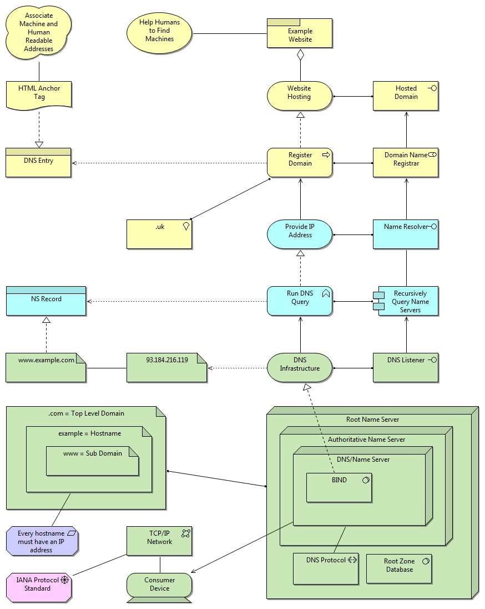

# The Domain Name System modelled according to Archimate

The Domain Name System modelled
according to Archimate

The [Archimate](http://www.opengroup.org/subjectareas/enterprise/archimate)
modelling language is a way of describing Enterprise and Solution
architectures. In the interests of learning Archimate I've attempted to model
the universally well-known [Domain Name
System](http://en.wikipedia.org/wiki/Domain_Name_System) in the diagram
opposite. I'm not really expert in DNS either, but because DNS is a system
that most Architects know *something* about, it seems like a good candidate
for sharing some modelling knowledge.

The tool used to render the model was [Archi](http://www.archimatetool.com/).

:calendar: February 9, 2014

## thoughts on "The Domain Name System modelled according to Archimate"

I'm afraid I find it a bit confused. Many question marks for me, e.g.:

- Isn't the root zone database just an Artefact of a Data Object (depending on the layer)?  
- Why is the Registrar resolving a name?  
- What does these Nestings of Nodes mean? Aren't you relating three independent servers here in a way you shouldn't?  
- Are you sure .uk is a Location?  
- Are you sure <http://www.example.com> and the IP address are Artefacts?  
- Register Domain Realizes Website Hosting?  
- Used-By between Registrar and the Interface?  
- Association between Application Component and Interface?

And many more at first glance. I think, btw, that you're wrong thinking that
most architects know how the DNS system really works.

But, having said that, trying to model things is the best way to learn it.
Maybe better to model things you know really well at first
