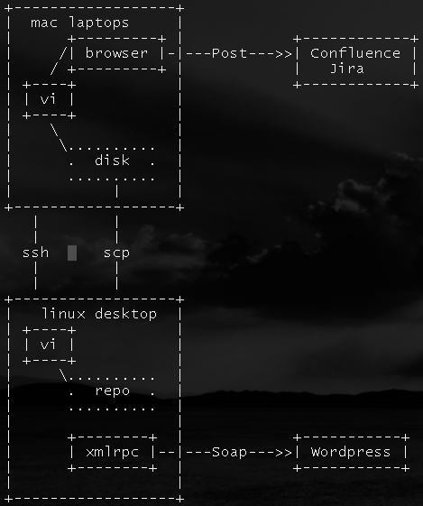

# Getting a bit better at blogging

My written thoughts are scattered all over the place. Here are my user  
stories:

As I blogger I want to  
- keep ideas/thoughts in the cloud, i.e. distributed  
- have a single process/store for Work, Family and Music  
- continue to use Vim as the editor  
- have the blog running on my own domain at fnarg.net

By blog I mean something that is text and written by me.  
This diagram shows the activities that go into making a me blog.

*Putting it into practise*

So I found this plugin for Vim called Blogit that doesn't quite fit all my
use-cases but it does look good.  
I tried to install Blogit:

http://www.lamolabs.org/blog/2083/managing-wordpress-posts-with-vim/  
but the Mac Vim doesn't come with Python.  
Ok so I'll use the Linux Vim but that has this bug:

`  
Error detected while processing .vim/plugin/blogit.vim:  
line 1781:  
Traceback (most recent call last):  
File "", line 9, in ?  
ImportError: cannot import name CalledProcessError  
Press ENTER or type command to continue  
`

So I think I should upgrade Vim 7.0 to Vim 7.2

Download the Vim 7.2 source and now I have this other error. And like the
poster to [Vim support](http://vim.1045645.n5.nabble.com/Failed-to-build-vim-with-fedora-8-tgetent-not-found-tt1168290.html) I have a term library ):

`  
# locate libterm  
/lib/libtermcap.so.2  
/lib/libtermcap.so.2.0.8  
`  
So I went back to the use-case and started looking at the XMLRPC part.  
[This did the
trick](http://search.cpan.org/~senger/WordPress-V0.1.1/lib/WordPress.pm).
She's a good 'ol Perl!

And now I'm going to try and use it for the first time. If you can read this  
then it probably worked (:

Well it did, but the activity diagram got mangled, hmm ..

I still find WordPress a **complete pain** to use as an editor, but at least
this helped.  
<http://en.support.wordpress.com/code/posting-source-code/>

:calendar: Posted on March 20, 2011

