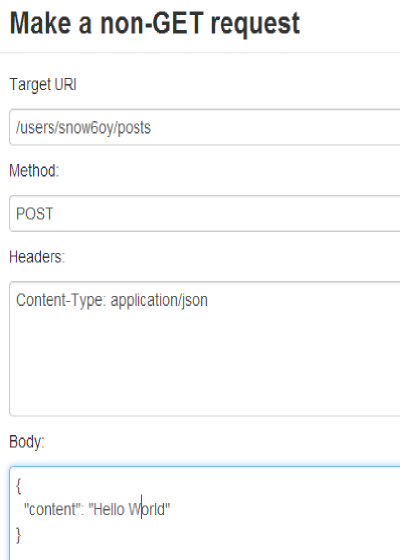
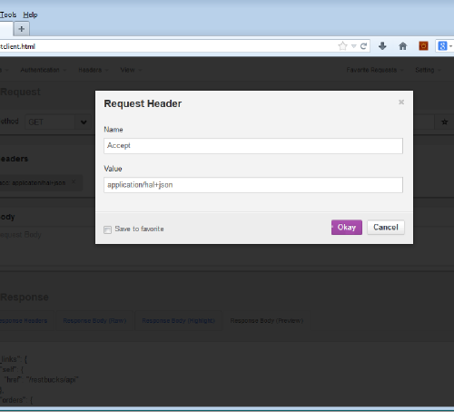
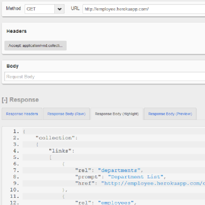

# Hello World in Hypermedia Style

After perhaps reading too much about Hypermedia (too much hype?) I started
getting the itch to _do something_. This quick blog is a record of the steps I
took towards a Hypermedia "hello world". The main tool I used was a plug-in
[REST client from
Mozilla](https://addons.mozilla.org/uk/firefox/addon/restclient/) but anything
that lets you set headers and inspect responses will do the job.

For this exercise I choose three popular Hypermedia designs: **HAL** ,
**Collection+JSON** and **Siren**. Each design has a high-level of abstraction
making it suitable for re-use and an active community of developers who are
busily engaged with various implementations.

## HAL

In the words of Mike Kelly, HAL's creator :

> _HAL is a format you can use in your API that gives you a simple way of
> linking_

See more of the [HAL specification](http://stateless.co/hal_specification.html
"HAL specification"). HAL is available in either JSON or XML and has a
[registered media-type](https://www.iana.org/assignments/media-
types/application/vnd.hal+json "HAL registration record on IANA") of

>
>     application/hal+json

Mike has documented the HAL design by providing an interactive [ HAL
Browser](http://haltalk.herokuapp.com/explorer/browser.html#/ "HAL browser").
This is the most immediate way to say "hello world" in Hypermedia style.
Firstly you use the HAL browser to create an account (hint: see the hints
:-)). Next you should navigate to `/users/:account` and then use the NON-GET
button to get into the following dialogue box.


Saying Hello World

It's okay if you type something other than "hello world" *yawn* but changing
anything else might break something .. To verify your creation navigate to the
[latest
posts](http://haltalk.herokuapp.com/explorer/browser.html#/posts/latest "HAL
Browser latest posts") and as-if-by-magic your entry will appear (fingers x).

The HAL browser is great way to quickly get a feel for what HAL is all about.
Armed with this knowledge I wanted to take a step towards a HAL client that
could be controlled independently, and ultimately deployed in another context.
The HAL browser seemed tightly coupled to the server, so rather than unpick
it, I dug around and found another server running on the [HAL builder
site](http://gotohal.net/). I made the following request using my trusty REST
client.

>
>     GET http://gotohal.net/restbucks/api
>     Accept: application/hal+json

And in case you weren't paying attention earlier, here's a picture.



The HAL builder dutifully obeyed my request (yes, the Accept header is
necessary) and gave me the following response.

    
``` 
    {
        "_links": {
            "self": {
                "href": "/restbucks/api"
            },
            "orders": {
                "href": "/restbucks/api/orders"
            }
        },
        "name": "RestBucks Store",
        "project": "restbucks",
        "version": "0.0.1"
    }
```
Now if I was a robot, I would crack-on and apply some automation to the above.
Here are our first clues about Hypermedia. Custom media-types and machine-
based connections! There's way [more discussion about using
HAL](https://groups.google.com/forum/#!forum/hal-discuss "Google groups HAL")
in the forum.

## Collection+JSON

[Mike Amundsen](http://amundsen.com/ "Mike Amundsen personal site") is the
author of Collection+JSON and says it is

> _a JSON-based read/write hypermedia-type designed to support management and
> querying of simple collections_

And just like HAL, Collection+JSON has its very own [registered media-
type](https://www.iana.org/assignments/media-
types/application/vnd.collection+json). To get a test response from
Collection+JSON we'll return to our REST client. As before set the client up
for the target service and specify the media-type.

>
>     GET https://graphviz-ewf.rhcloud.com
>     Accept: application/vnd.collection+json

This Hypermedia server responds with the following.

    
``` 
    {
      "collection": {
        "version": "1.0",
        "href": "http://graphviz-ewf.rhcloud.com:80/",
        "links": [
          {
            "href": "http://graphviz-ewf.rhcloud.com:80/",
            "rel": "home",
            "prompt": "Home API"
          },
          {
            "href": "http://graphviz-ewf.rhcloud.com:80/graph",
            "rel": "graphs",
            "prompt": "Home Graph"
          },
          {
            "href": "http://graphviz-ewf.rhcloud.com:80/register",
            "rel": "register",
            "prompt": "User Register"
          },
          {
            "href": "http://graphviz-ewf.rhcloud.com:80/login",
            "rel": "login",
            "prompt": "User Login"
          }
        ]
      }
    }
```
Graphviz is open source graph visualization software. The Graphviz API was
designed to allow new users to register, add graph definitions and retrieve
those definitions in various representations (pdf, jpg, png, gif). From the
[example API requests](https://github.com/EiffelWebFramework/graphviz-
server/wiki/Collection-JSON-Graphviz-Hypermedia-API) that are available in the
Graphviz documentation, this looks like a well-conceived implementation of
Collection+JSON. As authentication is required to use the Graphviz service I
decided to continue my tour and found a [Collection+JSON
Browser](http://collection-json-explorer.herokuapp.com/ "C+J Browser"). The
browser functions much like the HAL browser except that the Hypermedia server
is de-coupled from the client. The example [Employee data is
open](http://employee.herokuapp.com/ "Hypermedia server") and this means we
can hit the endpoint directly from .. yep that's right our friend the REST
client.


The above example shows a response from the Employee test data. Like HAL,
Collection+JSON has a strong [developer community](https://groups.google.com/forum/#!forum/collectionjson "Collection+JSON Google group").

## Siren

Let's complete our excursion with the newest design reviewed here. Kevin
Swiber describes [Siren](https://github.com/kevinswiber/siren "Siren on
Github") as:

> _a hypermedia specification for representing entities_

And like HAL and Collection+JSON, Siren has a [registered media-
type](https://www.iana.org/assignments/media-
types/application/vnd.siren+json).

> `application/vnd.siren+json`

To make our "hello-world" request to Siren we'll use a [Siren
Browser](http://siren-browser.herokuapp.com/ "Siren Browser") developed by
[Wurl](http://wurl.com/). Incidentally it's great to see commercial API
providers, such as Wurl and Graphviz embracing Hypermedia designs (this is the
future :-)). Let's point this Hypermedia client at a test Hypermedia server
that Kevin has running on heroku. As this service is read only (404, "Cannot
POST /users") we cannot use it to make a "hello world" but the action for
creating a user seems clear enough from the response to the initial GET.

    
``` 
    GET http://siren-alps.herokuapp.com/
    accept:application/vnd.siren+json
    
```
Here is the response. It has been trimmed down to the essential bit.

    
``` 
    {
        "actions": [
            {
                "name": "user-add",
                "href": "http://siren-alps.herokuapp.com/users",
                "method": "POST",
                "fields": [
                    {
                        "name": "user",
                        "type": "text"
                    },
                    {
                        "name": "email",
                        "type": "text"
                    },
                    {
                        "name": "password",
                        "type": "password"
                    }
                ]
            }
        ]
    }
```
Like the others, the [Siren
gang](https://groups.google.com/forum/#!topic/siren-hypermedia/ "Siren Group")
also hang out and share stuff.

## Final thoughts

Something that all of the three Hypermedia designs have achieved is that at no
point was it necessary to Read-The-Fscking-Manual. This is a Very Good Thing
for [Developer Experience](http://uxmag.com/articles/effective-developer-experience). This is another clue for our understanding of Hypermedia design.
Self-discovery! As said earlier, each design also has a high-level of
abstraction. The flexibility provided by this abstraction does however make
design selection seem rather arbitrary. Which of the three Hypermedia designs
are right for me?!? I hope this will be the subject of my next excursion.
Thanks.

:calendar: September 8, 2013
