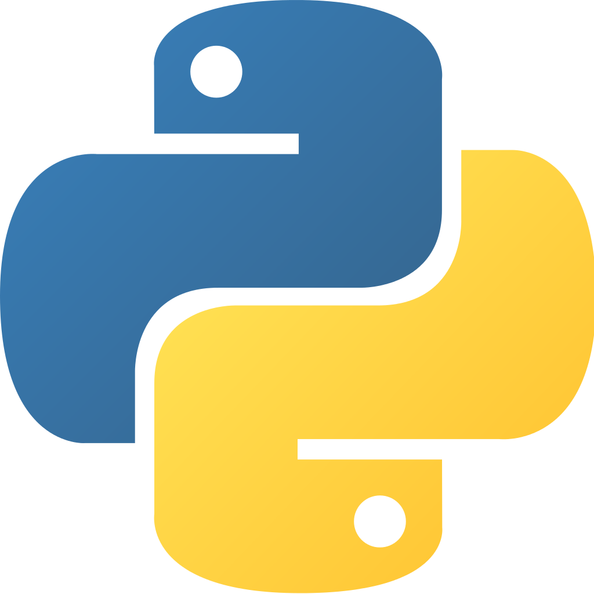

# Login to CAS using Python

[CAS](http://jasig.github.io/cas/4.2.x/index.html) is a protocol for implementing Single-Sign-On authentication services
Python is a programming languages often used to develop web applications

To protect a Python generated web page with a CAS session [a client of the CAS server](https://jasig.github.io/cas/4.0.x/integration/CAS-Clients.html) has to be added to the logic of the page. Users accessing the protected page are prompted to login unless a session already exists in their browser. There are many CAS clients written in Python and this blog is a review of them. Leave a reply if any are missing and I will take a look. 

Most CAS clients are written in the context of a Python framework. [Django](https://www.djangoproject.com/) is one of the most popular, so we’ll start there.

The [original client](https://bitbucket.org/cpcc/django-cas) for django supported CAS protocols 1 and 2. [Ming Chen’s client](https://github.com/mingchen/django-cas-ng) inherits from the above and added support for version 3. The same author provides some [Python CAS utils](https://github.com/python-cas/python-cas) for testing. [Another CAS client](https://github.com/KTHse/django-cas2) for Django is also derived from the original client but did not add support for version 3. Jerome Leleu is that author of the pac4j Java client and provides a [python demo](https://github.com/leleuj/python-cas-client-demo)  also based on the original. Although not a client of CAS, it’s worth mentioning that Jason Bittel has a [server implementation](http://django-mama-cas.readthedocs.org/en/) of the CAS protocol that runs on Django.

Another Python framework is Flask and [Flask-CAS](https://pypi.python.org/pypi/Flask-CAS/0.3.0) is a client for that framework. The client for [Twisted](https://github.com/cwaldbieser/txcas) looks like an incomplete effort at both a client and server.

[Kellen’s client](https://github.com/Kellel/bottle-cas) is for the lightweight bottle.py framework. Bottle.py can be either Python version 2 or 3. This client was written for Python 2.7.

The remaining clients in this review are designed to work in either a CGI or WSGI context.

[Ian Wright](https://github.com/wrighting/cas_wsgi_middleware) has a fairly recent client that support protocol, 3 and Python version 3. It is designed for an Apache context. The [earliest client](https://wiki.jasig.org/display/CASC/Pycas) (2011) seems to be by Jon Rifkin and runs as a Python CGI Web app (although the install failed for me). Ryan Fox has a package of the [Rifkin client](https://pypi.python.org/pypi/pycas) for pip installers. This client can also be found adapted for WSGI and embedded in a [PriceHistory project](https://github.com/18F/PriceHistoryAuth). And for completeness here is link to an [ancient version](https://sp.princeton.edu/oit/sdp/CAS/Wiki%20Pages/Python.aspx) that looks best forgotten.

### Summary

The client that worked for me was Kellen’s client which installed easily with pip. Having a working bottle.py installation was the biggest factor influencing my choice. Ian Wright’s client was next in line and for someone with a working Django environment then the Ming Chen version looks good.

:calendar: Posted on May 6, 2016
