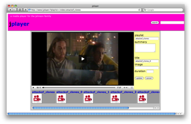

# How to make a media player

I was looking for a little project to keep me busy over Christmas and decided
to have a look at organising the contents of /home/media. The media directory
on my Red Hat Linux box holds:

`  
3523 audio files  
595 video files`

It got called **jplayer** because its for private use (by the johnsons) and
**j** follows **i** and the flash player I used is called **jwplayer**.

Some top-level ideas

  * Things should be bookmark-able
  * Editing and managing meta-data had to be possible during playback.
  * And some of the RESTful ideas that are running around from my day job should find their way into the design. 

In the end it was made using: Perl, MySQL, Apache (XSSI), Javascript including
SWFobject, Flash (JWplayer) and CSS. My background is in Perl and database so
the challenges were going to be in the javascript and CSS. Here is a step-
through the process of creating and playing a media file.

On the command line use

> find

to make an input file. Looks like this:  
`  
file=/audio/morcheeba/shoulder_holster.mp3  
file=/audio/morcheeba/fear_and_love.mp3  
file=/audio/morcheeba/dungeness.mp3  
`  
And then use curl to upload those entries to the database using an HTTP PUT  
`  
$ curl -T .avlib http://localhost/cgi-bin/avlib.pl  
added 3 rows ok  
`

To start playing the files I have to use a browser and enter a search phrase.
An onClick() event creates an Ajax call to the web service. It looks like `
jplayer/?q=morcheeba`

The output from the web service produces a list.

`  
<ul>  
<li>  
<a href="/jplayer/?playlist=/audio/morcheeba">morcheeba</a>  
<div class="summary"></div>  
<div class="small">audio/mpeg</div>  
</li>  
</ul>  
`

Results are piped through a pager so you scroll through 5 items at a time.
Selecting an item from the search results loads a new page (to get the
bookmark) and displays the playlist. In this context a playlist is just all
the files in a folder. Each file has a link that will load the movie into the
player and displayer the meta-data in a webform. For example:

`  
<a href=""  
onclick="loadSWF( '/audio/morcheeba','shoulder_holster.mp3' , 'jwplayer');  
updateForm( '/audio/morcheeba','shoulder_holster.mp3');  
return false;">shoulder_holster>/a>  
`

Playback is controlled through the Flash object. Once the meta-data is updated
an Ajax calls generates a POST to send the new data to the server.

### The web service

`  
PUT /path/to/avfile  
200 returns text summary of new rows added  
400 returned zero rows

POST a set of REQUEST VARIABLES representing an item  
200 returns string saying 'thanks'

GET ?q=Search+String  
200 returns a paginated list of playlists matching string

?playlist=/path/to/file  
200 returns data items as a web form

no parameters displays name and version  
`

The Perl uses the HTML::Template module to create the presentation layer and
the DBI modules to access the MySQL. Otherwise it's hand-written, even the CGI
functions (I was surprised that CGI.pm didn't help do the PUTs).

### Data schema

```
CREATE TABLE playlist (  
pk_pldir varchar(255) NOT NULL,  
playlist varchar(127) NOT NULL,  
mimetype char(23) NOT NULL,  
summary varchar(1023),  
PRIMARY KEY (pk_pldir)  
);

CREATE TABLE avfile (  
pk_pldiravfile varchar(255) NOT NULL,  
fk_pldir varchar(255) NOT NULL,  
avfile varchar(255) NOT NULL,  
title varchar(255) NOT NULL,  
duration int(4),  
thumbnail varchar(127),  
PRIMARY KEY (pk_pldiravfile)  
);

CREATE TABLE pldir__tag (  
pk_pldirtag varchar(255) NOT NULL,  
fk_pldir varchar(255) NOT NULL,  
tag varchar(63) NOT NULL,  
PRIMARY KEY (pk_pldirtag)  
);  
```

### Web client

There are 3 main areas of the page.

  1. banner and search box 
  2. SWF player window and playlist panel
  3. search results OR html form to update playlist metadata

I don't have a server to host jplayer on tinternet, but here's a screen grab:



### To do

  * Currently I'm using AVS to convert movies FLV. Have upgraded ffmpeg 0.5 and would prefer to use ffmpeg for scripting 
    * a series of thumbnails (or if audio use album art or an icon)
    * calculate the duration
  * Improve search by filtering through audio or video

### References

[JW Player](http://developer.longtailvideo.com/trac)  
[HTML playlist](http://www.gdd.ro/flvplayer/examples/playlist/example-playlist.html)  
[FFmpeg](http://www.linuxjournal.com/article/8517)  
[Ajax](http://www.openjs.com/articles/ajax_xmlhttp_using_post.php)  
[SWF Object](http://code.google.com/p/swfobject/wiki/documentation)

:calendar: Posted on January 31, 2010
