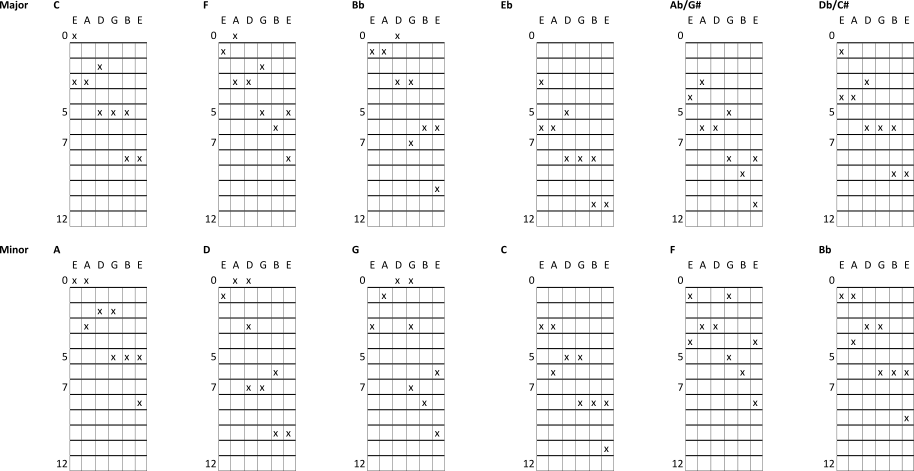
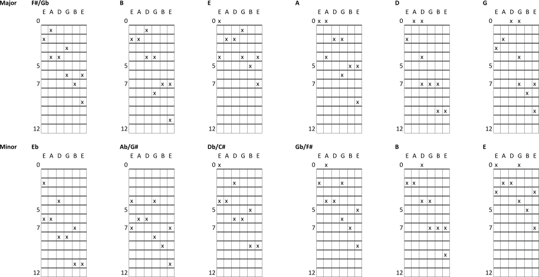

# Muso

Songs, charts and other strummings

## bossa nova heroes

  * [marcus valle](https://youtu.be/3Wa4L17R4hM?list=PL18CCFA83C26E2D2F)
  * carlos lyra
  * [edu lobo](https://youtu.be/17bDXW6ex_0?list=PL18CCFA83C26E2D2F)
  * nara leao
  * wanda de sah
  * sergio mendes
  * toquinho
  * dori caymmi
  * joyce
  * tamba trio
  * joao gilberto
  * baden powell
  * vinicius moraes
  * tom jobim
  * [sylvia telles](https://youtu.be/WWvYUpKhVd0?list=PL18CCFA83C26E2D2F)
  * roberto menescal

:calendar: Posted on June 10, 2015

## violão heroes

my top ten heroes all play guitar in a brazilian style.

  * [Baden Powell](http://brazil-on-guitar.de/ "baden powell")
  * [Yilo Quinones](https://www.youtube.com/channel/UClZ6lBIqk16C7JdKU9DgIfQ "Yilo Quinones")
  * [Paulo Bellinati](http://www.bellinati.com/ "Paulo Bellinati")
  * [Angelo Franzi](https://www.youtube.com/playlist?list=PL8F597FC2B28F9AA4 "Angelo Franzi")
  * [troubleclef](https://www.youtube.com/user/troubleclef "troubleclef")
  * [Chibai Kosei](http://studio-script.com/ "Chibai Kosei")
  * [Cyrloud](https://www.youtube.com/playlist?list=PLG6B2Q2W-s6cucT1Kcsd6EvUAlXK4590G "cyrloud")
  * [Antonio Carlos Barbosa Lima](http://players.guitar-tube.com/carlos-barbosa-lima "Barbosa Lima")
  * [Denian Arcoleo](https://www.youtube.com/user/DenianArcoleo "Denian Arcoleo")
  * [Gentil Montaña](http://www.gentilmontana.org/ "gentil montana")

:calendar: Posted on March 29, 2015

## Playing scales on the guitar

As a double-bass player I learnt that big intervals are hard. My approach to
playing scales was always about learning how to stretch. Here's how I carried
that idea into my guitar playing.

:calendar: Posted on September 2, 2013

## Repertoire for a non-existent Brazilian band in South Wales

I want to be in a band that plays these <sigh>

Isaac Hayes - Walk on by  

Bill Withers - Ain't No Sunshine  

George Benson - This Masquerade  

Jorge Ben - Oba la vem ela  

Seu Jorge - Tive Razao  
http://youtu.be/V20SZtLXBK4

Morena Veloso - Deusa do amour  

Jorge Ben - Mas Que Nada  

Evinha - Olha eu Aqui  

Brazil 66 - Night and Day  
http://www.youtube.com/watch?v=3UuAx5oMpGY

Astrud Gilberto - Aqua de Beber  
http://www.youtube.com/watch?v=sT2BloTgw7k

:calendar: Posted on February 13, 2011

## A review of a Michael Blake album

This is about the fifth Michael Blake album I've heard. I'm not saying it's
the best, but I've never written anything about the others so that says
something doesn't it? The album I'm all excited about is called  
[The World Awakes: Tribute to Eli Lucky Thompson](http://www.amazon.com/World-Awakes-Tribute-Lucky-Thompson/dp/B000VRRS34)  
I have to say straight away that I'd never heard of Lucky Thompson, but that
kind of makes it interesting doesn't it? A bit like enjoying an actor's
impersonation of someone that you've never seen. You don't have to get hung up
on whether it's a good impersonation or not. Even without the reference you
still get something of the style, the musical dynsasty. As you might expect
from a tribute album it's not really breaking new ground. It is great music,
but the intention isn't to shock or create the next Shape Of Things To Come.
What makes it so good is that the more you listen to it the more it unpeels,
like an onion. Each layer you strip away is clean and fresh. It's really quite
amazing how diverse the influences and styles that are represented here really
are. When you first listen to it, you don't think "oh there is klezmer and
south african" as well as some be-bop, hip-hop etc.. . It's so deep in the mix
you don't see it at first. Everything is so coherent that the influences seem
secondary. Like soup boiled down to make new flavours. This is really
compelling music. Actually it may even be new music that is emerging after
all. Sure, there is replication (and you can feel the concern for
authenticity) but it's never lazy emotionally. Whether it's explicit and
uncensored or ephemeral mixtures of bitter and sweet it just feels vivid and
sparkly throughout. This is a great album. Thank you Michael.

:calendar: Posted on November 7, 2010

## Forties jazz music

The [siren sisters](http://www.thesirensisters.co.uk) got me interested in old
stuff from the forties. Here are my top five from this era:

1\. This is the swing era and no-one swings better than basie.  
http://www.youtube.com/watch?v=iNz1_xJ4Ur8&fs=1&hl=en_US

2\. Here's Carmen it's show time  
http://www.youtube.com/watch?v=5DBA5tnAJDk&fs=1&hl=en_US

3\. Mr Sandman has been with me as long as I can remember

http://www.youtube.com/watch?v=xDXT7wC9jrc&fs=1&hl=en_US

4\. The best dance music is from Cuba

http://www.youtube.com/watch?v=Qp6khgW2tn8&fs=1&hl=en_US

5\. Why is this song sad and uplifting at the same time?

http://www.youtube.com/watch?v=LREpVzEQ1T8&fs=1&hl=en_US

:calendar: Posted on November 5, 2010

## Low Rider

Such a hip video.

http://www.youtube.com/watch?v=1rrsj_auEKs&fs=1&hl=en_US

:calendar: Posted on October 31, 2010

## Repertoire for a non-existent West Coast jazz band in Wales

By West Coast Jazz I'm thinking Wes Montgomery and Jimmy Smith. I live in
Wales and I'm interested in this sound.

**Line-up (of this dream band)**  
guitar, organ, double bass, drum

**Repertoire**

[Four On Six](http://www.youtube.com/watch?v=BqLDTKun4so),  
\+ [So What](http://www.youtube.com/watch?v=P4TbrgIdm0E),  
\+  The Shadow of Your Smile  
\+ [My Funny Valentine](http://www.youtube.com/watch?v=jvXywhJpOKs),  
[Nicas Dream](http://www.youtube.com/watch?v=SbXrdm63OAA),  
\+ Bossa Dorada,  
[Movin On](http://www.youtube.com/watch?v=4eNYRYn4y_A)  
\+ [Cariba](http://www.youtube.com/watch?v=UtvilT2LZXc)  
[Windjammer](http://www.youtube.com/watch?v=Dv2DiBC6eXg)  
\+ [I Got A Woman](http://www.youtube.com/watch?v=Mrd14PxaUco)

[ Sookie, Sookie](http://www.youtube.com/watch?v=g0N_hd0drIc)

\+ Milestones  
\+ Agua De Beber,  
\+ Besame Mucho  
\+ Nature Boy

**Artists**  
Jim Mullen, Grant Green, George Benson, Jack McDuff, Chet Baker

[youtube=http://www.youtube.com/watch?v=hhZk4piVpbY&hl=en_US&fs=1&border=1]

[youtube=http://www.youtube.com/watch?v=vqSLoxwkCYE&hl=en_US&fs=1&border=1]

:calendar: Posted on June 6, 2010

## Gypsies entertain the brethren

I've never been inside a masonic lodge before. That's one of the best (and
worst) things about being a live performer -- you travel a lot. Despite a
somewhat faded grandeur [The Guild Hall](http://www.guildfordhall.com/) has an
impressive architecture that was teeming with life at the brethren's annual
let-the-wives-in event. We Gypsies (also known as [5 Go Swing](http://www.5goswing.com)) swung hard and were rewarded with some yi-haw
clapping and blushingly nice compliments from our host. As I scanned the
audience I looked for familiar faces (Dan Brown?) but it wasn't my kind of
crowd.

:calendar: Posted on January 31, 2010
