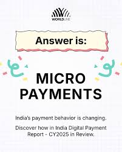

# Reduction with micropayments

The environmentalists have taught us the three Rs.

  * Reduce
  * Reuse
  * Recycle

**Reduction** makes us think about unnecessary items, such as packaging.
Packaging is useful to protect items we purchase and to advertise the contents
of the product.

**Micropayments** is a trend in consumer behaviour. Advancement in payment
systems makes it common-place to purchase low-value items electronically.

Let's say I want to purchase one litre of cooking oil. My only choice is to
purchase a plastic bottle along with my oil. This is because there is no
reasonable means to transport the oil from the supermarket to my home. Taking
my old bottle for a refill doesn't help, because oil is not sold on tap. This
is because the cooking oil vendor has a barcode stamped on the bottle in order
to collect payment. To persuade the vendor to sell me his oil on tap I need to
replace the barcode with something else.

This is where micropayments can help. With an Near Fields Communication device
(NFC) attached to a dispenser the point of sale and collection can be
combined. Oil can now be purchased from the dispenser using any container of
my choice. Given this option, I would choose to Reduce the number of plastic
bottles going from my home to landfill 🙂

:calendar: Posted on November 17, 2018
