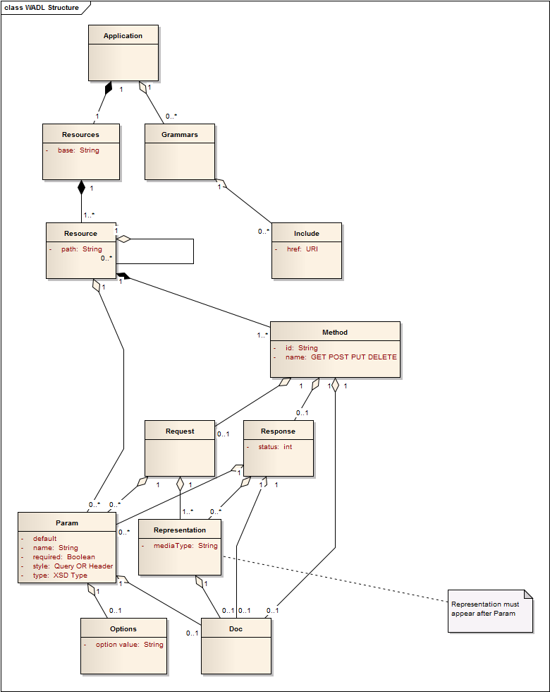

# Are WADLs yesterday's news?

It has been four years since Sun's Marc Hadley put forward his proposal for a
Web Application Definition Language. Since the arrival of the WADL, we have
seen the API Economy boom and an almost overwhelming swell towards REST and
away from SOAP. Given that the WADL was intended to be the RESTful answer to
SOAP's WSDL you might have expected that the volume of WADLs would be rising
in equal proportion. Somehow it hasn't happened like that, so what's going
wrong?

The basic idea was that the WADL defined your REST interface in a way that
machine generated code could consume it. After all, APIs are aimed at machines
more so than humans. But a review of the clients that have actually committed
code to the WADL specification suggests that outside of the Java community
take-up hasn't really happened, and even within Java it is fairly sporadic. To
understand what's going on here, let's dig a little deeper into what a WADL
currently offers.

From this UML summary of a WADL you should be able to see that a number of
resources have been defined and attributed a URI, together with a method and
HTTP verb. Within the resource definition are the details of the
request/response cycle. For a full description try the [Apigee WADL
reference](http://apigee.com/docs/enterprise/content/wadl-reference "Apigee
WADL reference") or the original [submission to
W3C](http://www.w3.org/Submission/wadl/) .

[Detractors of the WADL](http://bitworking.org/news/193/Do-we-need-WADL "Do We
Need Wadl") talk about true Hypermedia clients exploring the interface through
the API responses. I think this is valid. But defining the contract between
the client and the server is not the only purpose of a WADL. It can also be a
general description of how an API is supposed to behave, even an API that
hasn't been built yet. Commissioning an API requires the establishment of a
different kind of contract; a contract between a Business Owner and an API
Designer. Using a WADL to express an API design maybe a side-effect of the
original purpose, however this discussion is really more about using a WADL in
the context of API design than it is about implementing a REST client.

Much of the original motivation for the WADL seems to have been around
providing a simple and immediate alternative to the WSDL. The fact that it
hasn't been widely adopted suggests that the specification has gone too far
the other way. Is it overly simplistic? If so, what is missing - what should a
future WADL specification contain in order to overcome these limitations. Here
is my WADL wishlist.

  * UML and Documentation
  * Inheritance
  * Interpolation
  * Managing Application State
  * Cross-reference
  * Non-functionals
  * JSON + node.js module

**UML and Documentation**  
Most software design is done using UML. When it comes to applying the REST
architectectural style there is surprisingly little around in the UML world.
For example, the popular UML tool Enterprise Architect supports only WSDLs.
This is awkward when attempting to visualise RESTful designs in an Enterprise
context. An experimental attempt at bridging this gap is the [eaWadl
tool](https://www.assembla.com/code/eawadl/subversion/nodes/2 "eaWadl") that
imports a WADL into Enterprise Architect (disclaimer I wrote it).

In addition to using the WADL as part of the design process, another good use-
case is documentation. For example, the Web Application Definition Language is
used by [Enunciate](http://enunciate.codehaus.org/ "enunciate") as a framework
for human-readable content. The flexible `<doc>` tag really helps as it allows
sample JSON or XML payloads to be embedded alongside the request and/or
response. A common and effective ploy is to render the WADL documentation as
HTML in response to an Accept Header of `text/html` (which a browser sends by
default).

**State**  
With a 
[Home Document](http://datatracker.ietf.org/doc/draft-nottingham-json-home) you don't need a WADL to define the interface up-front, just grab the
index and off-you-go. This is the logical extension of the Hypermedia
approach. To explore this idea, let's imagine that we have a REST interface to
describe a game of chess. It should be straight-forward enough to imagine how
each chess piece could be given a resource endpoint that would describe the
various behaviours of each piece. For example a `GET /pieces/king` would
provide a response that says move one square in any direction. Okay that's
fine. But what if we want to record a game of chess? This is a whole new tin
of worms; that of managing the state of the game board. For example `PUT
/board/12/60/Qf2+`. In it's response the server should be helping the client
to manage the application state by offering a link to `/board/12/60`. This is
because only the server knows (with authority) that the game on board 12 is on
the sixtieth move, that the White Queen has put the Black King in check and it
is now Black's turn.

In this scenario a WADL can be comfortably used to define the static reference
data: `GET /pieces/king`. But because the game state is (obviously) unknown at
design time, a different approach is needed. The approach should involve
making general statements about the Hypermedia syntax used by the API to
maintain state. The request and response elements offered by the current WADL
don't constrain how the syntax should be defined. But I would go further and
argue that it should. Elements such as `<id>`, `<rel>`, `<class>` and `<href>`
have become so baked into Hypermedia designs that they deserve an exclusive
place in our new generation WADL.

**Cross-reference**  
A general issue with APIs is that of API discovery. How are you supposed to
find out about the existence of an API in the first place? And if you are
managing a group of related APIs, how does the discovery of one API help you
find out about the other members of your API family. Google have tackled this
problem through 
[their discovery API](http://www.apievangelist.com/2011/05/21/discovery-services-for-common-apis/). But what about everyone else? As the WADL already allows us to
reference external Xml Schemas, why shouldn't we be able to reference other
WADLs?

` <grammars>  
<include wadl="http://example.com/xyz/doc.wadl"/>  
</grammars>  
`  
With over 9,000 APIs currently registered on [Programmable
Web](http://www.programmableweb.com/) cross-referencing should help bring some
organisation to the API space.

**Inheritance**  
It's generally polite to _reply_ to a question in whatever language was used
to _ask_ the question. Consequently it's annoying that each `<request>` and
`<response>` declaration needs a separate `<representation>` tag. Although the
WADL is hierarchical there is no sense of a child node that inherits from the
parent. Wouldn't it be easier to declare the base representation in the root
`<resources>` tag, and use the child nodes to override any exceptions?

**Non-functionals**  
Functionality is one thing, but if the security features of the API disallow
access then it's game over. If our new WADL has helped you discover an API
then it seems logical that some declaration of the required authentication is
made at the point at discovery. For example `<authn>` and `<authz>` tags might
have values such as "oauth" or "x509" together with a
`<profile="developer.example.com/register">` statement for humans. Similarly a
`<status>` parameter could broadcast downtime whenever an origin service
becomes unavailable.

**Error Handling**  
While you can get a long way with HTTP status codes many error responses are
specific to a particular domain. A common strategy is therefore to return a
<code>200</code> to show that the underlying HTTP communication was successful
and then maintain a set of API specific error codes. The status attribute of
the `<response>` element should be able to document the existence of the
bespoke messages.

**Interpolation**  
APIs are deployed in multiple environments. In reality the `<resources>` tag
is likely to resolve to a number of hosts.

  * http://dev.example.com/api
  * https://example.com/api

Rather than relying on an external tool (such as Maven) it should be possible
to abstract the hostname for use in multiple environments.

**JSON + node.js module**  
With NodeJs currently the most second popular download on github, the march of
JSON seems set to continue. WADLs are of course expressed using XML.
Frameworks such as [deployd](http://deployd.com) illustrate the immediacy of
using Node to define and create a REST service. With a little work, it's
possible to start this process from a WADL. With a bit more effort it would be
possible to encapsulate the WADL import process using an Node module, similar
to the work underway at [RestDoc](http://www.restdoc.org/).

In summary, we should stick with the WADL not particularly because of it's
original intentation as a machine-readable definition of a service, but
because the process of designing and developing APIs is lacking a reference
language. The WADL just seems like a sensible place from which to embark.

:calendar: Posted on June 24, 2013

##  One thought on "Are WADLs yesterday's news?"

  1.  **[SutoCom](http://www.sutocom.net)** says:

Reblogged this on [Sutoprise Avenue, A SutoCom
Source](http://sutocom.net/2013/06/27/are-wadls-yesterdays-news/).

